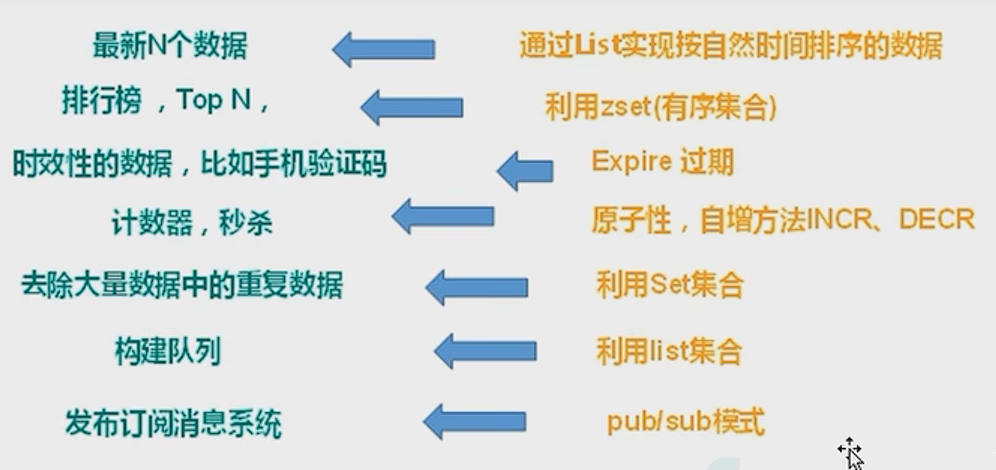

**问题一：**分布式服务器session对象不一致，共享问题。

1.session存储到客户端cookie（不安全）

2.session复制到各个分布式服务器（数据冗余）

3.存储到NoSQL数据库（完全在内存中，速度快）

**问题二**：NoSQL数据库可以解决IO压力

将查询频繁的数据缓存到NoSQL数据库

### NoSQL

**适用场景**

对数据高并发的读写。

海量数据的读写。

对数据高可扩展性的。

### Redis

几乎覆盖了Memcached的绝大部分功能数据都在内存中，支持持久化，主要用作备份恢复除了支持简单的key-value模式，还支持多种数据结构的存储，比如list、set、 hash、 zset等。一般是作为缓存数据库辅助持久化的数据库。



````shell
redis.server 前台启动
redis-server /etc/redis.conf 后台启动

redis-cli 连接服务端

redis-cli shutdown 关闭
````

redis默认提供16个数据库，默认用0数据库

select 8 切换到8数据库

#### redis特点

1. 单线程+多路IO复用

2. 支持多种数据类型

3. 支持持久化

#### 常用数据结构

**value类型**

**String字符串**

String是Redis最基本的类型，你可以理解成与Memcached 一模一样的类型，一个key
对应一个value。

String类型是二进制安全的。 意味着Redis的string 可以包含任何数据。比如jpg图片
或者序列化的对象。

底层数据结构为**动态字符串**

String类型是Redis最基本的数据类型，一个Redis中字符串value最多可以是512M

````shell
set key value 设置key value
get key 取值
append key value 追加value
strlen(key) 获取值长度

setnx k1 v1 值存在设置不成功

mset k1 v1 k2 v2 设置多个key value
mget k1 k2 k3 获取多个值
msetnx k11 v11 k12 v12 k1 v11 任意一个存在全设置不成功

getrange name 0 3 范围查询
setrange key 3 abc 在第三位置设置abc

setex key 过期时间 value 

getset key value 取到旧值，被新值替换

incrby key 存的数值加1 原子操作（不会被线程调度机制打断）
decrby key 存的数值减1 原子操作

keys * 查看key

exists key 查看key存在

type key 查看key类型

del key 删除key（直接删除）

unlink key 删除key（选择非阻塞删除，异步删除）

expire key 10 设置key的过期时间

ttl key 查看key多少秒过期 -1表示永不过期，-2表示已经过期

select 1 切换数据库

dbsize 查看当前数据库key的数量

flushdb 清空当前库

flushall 清空所有数据库
````

**List链表**

Redis列表是简单的字符串列表，按照插入顺序排序。你可以添加一个元素到列表的头部(左边)或者尾部(右边)。它的底层实际是个**双向链表**，对两端的操作性能很高，通过索引下标的操作中间的节点性能会较差。

Redis将链表和ziplist结合起来组成了quicklist。 也就是将多个ziplist使用双向指针串起来使用。这样既满足了快速的插入删除性能，又不会出现太大的空间冗余。

```shell
lpush k1 value1 value2 设置值 value被头插法放入
lrange k1 0 -1 取所有值
rpush k1 v1 v2 v3 设置值尾插法
lpop k1
rpop k2 取完值，键也没有
rpoplpush k1 k2 右边取放到左边
lindex k2 0 获取索引位置
llen k2 获取长度
linsert k2 before[after] v11 v22 在链表v11前面或后面加入值v22
lrem k2 2 v2 从左边删除n个value
lset k2 0 v3 将第0个位置替换为v3
```

**Set集合**

Redis的Set是string类型的无序无重复元素集合。它底层其实是一个value为null的hash表，所以添加，删除，查找的复杂度都是O(1)。

```shell
sadd k1 v1 v2 v3
smembers k1
sismember k1 v1 判断k1集合是否有v1
scard k1 返回集合元素个数
srem k1 v1 v2 删除元素
spop k1 随机取出值
srandmember k1 n 随机取n个值，不会从集合中删除
smove k1 k2 v3 将k1的v3移动到k2
sinter k2 k3 返回交集数据
sunion k2 k3 返回并集
sdiff k2 k3 返回差集
```

**Hash哈希**

Redis hash是一个键值对集合。 
Redis hash是一个string 类型的field 和value的映射表，hash特别适合用于存储对象。
类似Java里面的Map<String，Object>。

Hash类型对应的数据结构是两种: ziplist (压缩列表)，hashtable (哈希表)。当field-value长度较短且个数较少时，使用ziplist, 否则使用hashtable。

```shell
hset k1 id 1
hget k1 name
hmset k1 id 1 name zhangsan
hexists k1 id 查看id是否存在
hkeys k1
hvals k1
hincrby k1 id 3
hsetnx k1 id 1 存在不能加
```

**Zset 有序集合**

Redis有序集合zset与普通集合set非常相似，是一个没有重复元素的字符串集合。

不同之处是有序集合的每个成员都关联了一个评分( score) ，这个评分( score )被用来按照从最低分到最高分的方式排序集合中的成员。集合的成员是唯一的 ，但是评分可以是重复了。
因为元素是有序的，所以你也可以很快的根据评分( score )或者次序( position )来获取一个范围的元素。
访问有序集合的中间元素也是非常快的，因此你能够使用有序集合作为一个没有重复成员的智能列表。

底层结构：hash结构（key为值，value为scores） 或者 跳表

```shell
zadd k1 200 java 300 c++ 400 mysql 500 redis
zrange topn 0 -1
zrange topn 0 -1 withscores
zrangebyscore topn 300 500 withscores 从小到大
zrevrangebyscore topn 500 200 withscores 从大到小
zincrby topn 50 java 增加scores
zrem topn java 删除指定
zcount topn 200 300 统计
zrank topn java 查询排名
```

#### 配置文件

```shell
#支持远程访问
# bind 127.0.0.1 -::1
protected-mode no 

tcp-backlog 511 #连接队列大小
timeout 0 #永不超时
tcp-keepalive 300 #检查心跳时间

databases 16

#设置密码
```

#### 发布和订阅

```shell
subscribe channel1 #订阅频道
publish channel1 hello #发布消息
```

#### 新数据类型

**Bitmaps（实际就是字符串）**

```shell
setbit k1 1 1
setbit k1 10 1
getbit k1 1 #偏移量
bitcount k1
bitcount k1 1 2
bitop and newname k1 k2
```

**HyperLogLog**

基数问题

```shell
pfadd k1 value
pfcount k1
pfmerge k1 k2
```

**Geospatial**

地理位置，经纬度的操作

```shell
geoadd k1 106.50 29.53 chongqing
geopos k1 shanghai
geodist k1 shanghai chongqing km 两个位置的直线距离
georadius k1 110 30 1000 km 一个范围内的地点
```

#### Jedis

```xml
//依赖
<dependency>
	<groupId>redis.clients</groupId>
	<artifactId>jedis</artifactId>
	<version>3.6.3</version>
</dependency>

<!-- redis-->
<dependency>
	<groupId>org.springframework.boot</groupId>
	<artifactId>spring-boot-starter-data-redis</artifactId>
	<version>2.4.5</version>
</dependency>
<!-- spring2.X 集成redis 所需common-pool2 -->
<dependency>
	<groupId>org.apache.commons</groupId>
	<artifactId>commons-pool2</artifactId>
</dependency>
<dependency>
    <groupId>com.fasterxml.jackson.core</groupId>
    <artifactId>jackson-databind</artifactId>
    <version>2.9.6</version>
</dependency>
```

```java
#Redis服务器地址
spring.redis.host=192 .168.140.136
#Redis服务器连接端口;
spring.redis.port=6379
#Redis数据库索引(默认为0)
srping.redis.database=0
#连接超时时间(毫秒)
spring.redis.timeout=1800000
#连接池最大连接数(使用负值表示没有限制)
spring.redis.lettuce.pool.max-active=20
#最大阻塞等待时间(负数表示没限制)
spring.redis.lettuce.pool.max-wait=-1
#连接池中的最大空闲连接↓
spring.redis.lettuce.pool.max-idle=5
#连接池中的最小空闲连接
spring.redis.lettuce.pool.min-idle=0
```

#### 事务

**Multi** 开启事务 组队

**Exec** 提交事务 提交队列

**Discard** 取消组队

组队阶段出错，整个队列取消

提交队列出错，出错的那个成员取消

**事务冲突**

- 悲观锁

  只要操作就加锁，操作完才释放锁

- 乐观锁

  不会上锁，通过给数据加版本号进行操作

**watch**

在执行multi之前，先执行watch key1 [key2]，可以监视一个(或多个) key ，如果在事务执行之前这个(或这些) key被其他命令所改动，那么事务将被打断。（乐观锁使用）

unwatch取消监视

**Redis事务三特性**

- 单独的隔离操作 
  事务中的所有命令都会序列化、按顺序地执行。事务在执行的过程中，不会被其他客户端发送来的命令请求所打断。
- 没有隔离级别的概念 
  队列中的命令没有提交之前都不会实际被执行，因为事务提交前任何指令都不会被实际执行。
- 不保证原子性 
  事务中如果有一条命令执行失败，其后的命令仍然会被执行，没有回滚。

连接池复用连接，解决连接超时问题。

**秒杀超卖问题解决：**

1.watch

2.开启事务

3.提交事务

但是这种情况会出现**库存遗留问题**，商品没卖掉

库存遗留问题解决方法：

**Lua脚本语言**

将复杂的或者多步的redis操作，写为一个脚本，一次提交给redis执行，减少反复连接redis的次数。提升性能。
LUA脚本是类似redis事务，有一定的原子性，不会被其他命令插队，可以完成一些redis事务性的操作。
但是注意redis的lua脚本功能，只有在Redis 2.6 以上的版本才可以使用。
利用lua脚本淘汰用户，解决超卖问题。
redis 2.6版本以后，通过lua脚本解决争抢问题，实际上是redis利用其单线程的特性，用任务队列的方式解决多任务并发问题。

#### 持久化操作

**RDB（Redis DataBase）**

在指定时间间隔内将内存中的数据集快照写入磁盘。

Redis会单独创建( fork)一个子进程来进行持久化，会先将数据写入到一个临时文件中，待持久化过程都结束了，再用这个临文件替换上次持久化好的文件。整个过程中，主进程是不进行任何IO操作的，这就确保了极高的性能如果需要进行大规模数据的恢复，且对于数据恢复的完整性不是非常敏感，那RDB方式要比AOF方式更加的高效。RDB的**缺点**是最后一次持久化后的数据可能丢失。

**写时复制技术**：需要两倍空间

**AOF（Append Only File）**

以日志的形式来记录每个写操作(增量保存)，将 Redis执行过的所有写指令记录下来(读操作不记录)，只许追加文件但不可以改写文件，redis 启动之初会读取该文件重新构建数据，换言之，redis重启的话就根据日志文件的内容将写指令从前到后执行一次以完成数据的恢复工作。

RDB和AOF同时开启，系统默认取AOF数据

**异常恢复**：可以利用自带命令对损坏的aof文件，进行恢复

AOF可以设置同步频率

#### 主从复制

主机数据更新后根据配置和策略，自动同步到备机的master/slaver机制，Master以写为主, Slave以读为主。

- 读写分离，性能扩展
- 容灾快速恢复，一台从服务器宕机，可以切换到其他服务器

info replication 命令打印信息

slaveof ip port 配置从服务器

**一主二从**

主挂了，从还是主服务器的从服务器

主从复制步骤：

1、 当从连接上主服务器之后，从服务器向主服务发送进行数据同步消息
2、主服务器接到从服务器发送过来同步消息，把主服务器数据进行持久化到rdb文件，把rdb文件发送从服务器，从服务器拿到rdb进行读取
3、每次主服务器进行写操作之后，和从服务器进行数据同步

**薪火相传**

**反客为主**

slaveof no one 把从机变成主机

**哨兵模式（sentinel）**

反客为主的自动版，能够后台监控主机是否故障，如果故障了根据投票数自动将从库转换为主库

sentinel.conf

sentinel montior masterName ip port

启动：redis-sentinel sentinel.conf

**主节点选举规则：**

根据slave-priority=12 值越少优先级越高

偏移量是指获得原主机数据最全的

每个redis实例启动后都会随机生成一个40位的runid

- 选择优先级靠前的
- 选择偏移量最大的
- 选择runid最小的

旧主机变为新主机的从节点

#### 集群

Redis集群实现了对Redis的水平扩容，即启动N个redis节点，将整个数据库分布存储在这N个节点中，每个节点存储总数据的1/N。
Redis集群通过分区( partition )来提供一定程度的可用性 ( availability )：即使集群中有一部分节点失效或者无法进行通讯，集群也可以继续处理命令请求。

集群无中心化，连接任意一台，都能操纵整个集群，即集群中任意一台机器都能作为集群入口。

vim全局替换：%s/6379/6380

```shell
#创建集群
redis-cli --cluster create --cluster-replicas 1 ip:port ip2:port2...
#以集群方式连接
redis-cli -c -p port
```

一个集群至少要有三个主节点。
选项 --cluster-replicasI 1 表示我们希望为集群中的每个主节点创建一个从节点。
分配原则尽量保证每个主数据库运行在不同的IP地址，每个从库和主库不在一个IP地址上。

**slots**

根据key值，计算出对应的插槽值，进而分配到相应的机器上。

```shell
cluster nodes#查询集群节点
mset name{user} lucy age{user} 20 #计算插槽按组名计算
cluster keyslot k1 #查询key对应的插槽值
cluster countkeysinslot 23123 #查询插槽23123内的key数
cluster getkeysinslot 449 1 #返回1个插槽中的键
```

**故障恢复**

主节点宕机，从节点成为主节点

宕机的主节点恢复后，作为原从节点的从节点

**优势**

- 实现扩容
- 分摊压力
- 无中心配置相对简单

**缺点**

- 多键操作是不被支持，要分组
- 多键的Redis事务不被支持的，lua脚本不被支持

#### 应用问题解决

##### 缓存穿透

产生条件：

- 应用服务器压力变大了
- redis命中率降低
- 一直查询数据库

现象：

- redis查询不到数据库
- 出现非正常URL访问

解决方案：

- **对空值缓存**：如果一个查询返回的数据为空(不管是数据是否不存在)，我们仍然把这个空结果( null )进行缓存，设置空结果的过期时间会很短，最长不超过五分钟。
- **设置可访问的名单(白名单)** :
  使用bitmaps类型定义一个可以访问的名单，名单id作为bitmaps的偏移量，每次访问和bitmap里面的id进行比较，如果访问id不在bitmaps里面，进行拦截，不允许访问。
- **采用布隆过滤器**： (布隆过滤器(Bloom Filter)是1970年由布隆提出的。它实际上是一个很长的二进制向量(位图)和一系列随机映射函数(哈希函数)。布隆过滤器可以用于检索一个元素是否在一个集合中。 它的优点是空间效率和查询时间都远远超过一般的算法，缺点是有一定的误识别率和删除困难。
  将所有可能存在的数据哈希到一个足够大的bitmaps 中，一个一定不存在的数据会被这个bitmaps拦截掉，从而避免了对底层存储系统的查询压力。
- **进行实时监控**：当发现Redis的命中率开始急速降低，需要排查访问对象和访问的数据，和运维人员配合，可以设置黑名单限制服务。

##### 缓存击穿

产生条件：

- redis某个key过期了，大量访问使用这个key

现象：

- 数据库访问压力瞬时增加
- redis里面没有出现大量key过期
- redis正常运行

解决方案;

- **预先设置热门数据**：在redis高峰访问之前，把一些热门数据提前存入到redis里面，加大这些热门数据key的时长。
- **实时调整**：现场监控哪些数据热门，实时调整key的过期时长。
- **使用锁**：
  - 就是在缓存失效的时候(判断拿出来的值为空) ，不是立即去load db。 
  - 先使用缓存工具的某些带成功操作返回值的操作(比如Redis的SETNX )去set一个mutex key
  - 当操作返回成功时，再进行load db的操作，并回设缓存，最后删除mutex key
    当操作返回失败，证明有线程在load db，当前线程睡眠一段时间再重试整个get缓存的方法。

##### 缓存雪崩

产生条件：

- 在极少时间段，查询大量key的集合过期情况

现象：

- 数据库压力变大造成服务器崩溃

解决方案：

- **构建多级缓存架构**：nginx缓存+ redis缓存+其他缓存( ehcache等)。
- **使用锁或队列**：
  用加锁或者队列的方式来保证不会有大量的线程对数据库一次性进行读写，从而避免失效时大量的并发请求落到底层存储系统上。不适用高并发情况
- **设置过期标志更新缓存**：
  记录缓存数据是否过期(设置提前量)，如果过期会触发通知另外的线程在后台去更新实际key的缓存。
- **将缓存失效时间分散开**：
  比如我们可以在原有的失效时间基础上增加一个随机值，比如1-5 分钟随机，这样每一个缓存的过期时间的重复率就会降低，就很难引发集体失效的事件。

#### 分布式锁

随着业务发展的需要，原单体单机部署的系统被演化成分布式集群系统后，由于分布式系统多线程、多进程并且分布在不同机器上，这将使原单机部署情况下的并发控制锁策略失效，单纯的Java API并不能提供分布式锁的能力。为了解决这个问题就需要一种跨JVM的互斥机制来控制共享资源的访问，这就是分布式锁要解决的问题。

**使用redis实现分布式锁**

- setnx上锁，del释放锁
- 锁一直没释放，设置过期时间，自动释放
- 上锁之后突然出现异常，无法设置过期时间了。

```shell
set users 10 nx ex 12
```

```java
setIfAbsent();
```

**锁可能会被别人释放，卡顿造成key过期自动释放。**

怎么避免：

- 第一步set lock uuid nx ex 10
- 第二步释放锁的时候，首先判断当前uuid和要释放锁uuid是否一样

**lua脚本保证删除原子性**

为了确保分布式锁可用，我们至少要确保锁的实现同时满足以下四个条件:

- 互斥性。在任意时刻，只有一个客户端能持有锁。
- 不会发生死锁。即使有一个客户端在持有锁的期间崩溃而没有主动解锁，也
  能保证后续其他客户端能加锁。
- 解铃还须系铃人。加锁和解锁必须是同一个客户端，客户端自己不能把别人加的锁给解了。
- 加锁和解锁必须具有原子性。