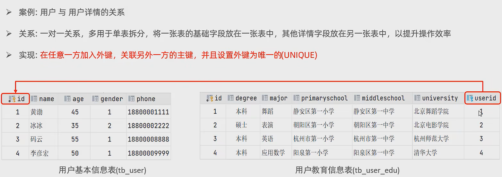

### 参考资料

> 视频链接： https://www.bilibili.com/video/BV1Kr4y1i7ru?p=2&share_source=copy_web&vd_source=6164cc1e15b15d47186e6ecfe12edef8
>
> 参考笔记：https://www.yuque.com/heychu/akbndd/zhuxqd

### SQL分类


### DDL

> 数据库定义语言：用来定义数据库、表、字段

#### 数据库操作

```sql
SHOW DATABASES;#查询所有数据库

SELECT DATABASE();#查询当前数据库

CREATE DATABASE 数据库名;#创建数据库

CREATE DATABASE [if not exists] itcast [DEFAUlT CHARSET 字符集] [COLLATE 排序规则];#创建数据库

DROP DATABASE [if exists] 数据库名字;#删除数据库

USE 数据库名;#使用数据库
```

#### 表操作-查询

```sql
SHOW TABLES;#查询数据库所有表

DESC 表名;#查询表结构

SHOW CREATE TABLE 表名;#查询指定标的建表语句

CREATE TABLE 表名{
	字段1 字段1类型[COMMENT 字段1注释],
	字段2 字段2类型[COMMENT 字段2注释],
	... ...
}[COMMENT 表注释];

CREATE TABLE tb_user (
  `id` int(11) COMMENT '编号',
  `name` varchar(50) COMMENT '姓名',
  `age` int(11) COMMENT '年龄',
  `gender` varchar(1) COMMENT '性别'
) COMMENT='用户表'
```

#### SQL数据类型

> 1. 数值类型


> 2. 字符串类型


> 3. 日期类型


```sql
CREATE TABLE emp(
	id int comment '编号',
    workno varchar(10) comment '工号',
    name varchar(10) comment '性别',
    gender char(1) comment '性别',
    age tinyint unsigned comment '年龄',
    idcard char(18) comment '身份证',
    entrydate date comment '入职时间'
) comment '员工表';
```

#### 表操作-修改&删除

```sql
ALTER TABLE 表名 ADD 字段名 类型(长度) [COMMENT 注释] [约束];#添加字段

ALTER TABLE 表名 MODIFY 字段名 新数据类型(长度);#修改数据类型

ALTER TABLE 表名 CHANGE 旧字段名 新字段名 类型(长度) [COMMENT 注释] [约束];#修改字段名和字段类型

ALTER TABLE 表名 DROP 字段名#删除字段名

ALTER TABLE 表名 RENAME TO 新表名#修改表名

DROP TABLE [IF EXISTS] 表名;#删除表

TRUNCATE TABLE 表名;#删除表，并重新创建该表

create table new_table_name select * from old_table_name;#复制表结构及数据

#复制表结构到新表，不复制数据
create table new_table_name select * from old_table_name where 1 = 2;
#或
create table new_table_name like old_table_name;
```

### DML

> 数据操作语言：对数据表的记录进行增、删、改

#### 插入

```sql
#1.给指定字段添加数据
INSERT INTO 表名(字段名1, 字段名2, ......) VALUES (值1, 值2, ......);

INSERT INTO employee(id, workno, name, gender, age, idcard, entrydate) VALUES (1, '1', 'Itcast', '男', 10, '123412341234123412', '2022-09-18');

#2.给全部字段添加数据
INSERT INTO 表名 VALUES(值1,值2,...);

INSERT INTO employee VALUES (2, '2', 'Itcast', '男', 10, '123412348234123412', '2022-09-17');

#3.批量添加数据
INSERT INTO 表名(字段1,字段2,......) VALUES(值1,值2,...),(值1,值2,...),(值1,值2,...);
INSERT INTO 表名 VALUES(值1,值2,...),(值1,值2,...),(值1,值2,...);

#4.复制旧表的数据到新表
insert into new_table_name(字段1,字段2,......) select 字段1,字段2,...... from old_table_name
```

#### 更新和删除

```sql
1. 更新
UPDATE 表名 SET 字段1=值1,字段2=值2,...[WHERE 条件];

UPDATE employee SET name='itheima' WHERE id = 1;
UPDATE employee SET name='xiaoming',gender='女' WHERE id = 1;
UPDATE employee SET entrydate = '2008-01-01';#修改所有数据的日期为2008-01-01

2. 删除
DELETE FROM 表名 [WHERE 条件]

DELETE FROM employee WHERE gender = '女';
DELETE FROM employee;#删除该表所有数据
```

### DQL

> 数据查询语言：查询数据库中表的记录
>
> 见readme.md

#### 多表查询

> 接readme.md的多表查询
>
> 表之间进行笛卡尔积，需要消除无效的笛卡尔积

##### 多表关系

###### 一对多（多对一）


###### 多对多


```sql
#例子
CREATE TABLE student(
    id   int auto_increment primary key comment '主键ID',
    name varchar(10) comment '姓名',
    no   varchar(10) comment '学号'
) comment '学生表';

INSERT INTO student VALUES (null, '黛绮丝', '2000100101'), (null, '谢逊', '2000100102'),
(null, '殷天正', '2000100103'),(null, '韦一笑', '2000100104');

CREATE TABLE course (
    id   int auto_increment primary key comment '主键ID',
    name varchar(10) comment '课程名称'
) comment '课程表';

INSERT INTO course VALUES (null, 'Java'),(null, 'PHP'),(null, 'MySQL'),(null, 'Hadoop');

CREATE TABLE student_course (
    id        int auto_increment comment '主键' primary key,
    studentid int not null comment '学生ID',
    courseid  int not null comment '课程ID',
    constraint fk_courseid foreign key (courseid) references course (id),
    constraint fk_studentid foreign key (studentid) references student (id)
) comment '学生课程中间表';

INSERT INTO student_course VALUES (null, 1, 1),(null, 1, 2),(null, 1, 3),(null, 2, 2),(null, 2, 3),(null, 3, 4);
```

###### 一对一

> 一张表拆分为两张表；两张表合并为一张表；



```sql
#一对一
CREATE TABLE tb_user(
    id     int auto_increment primary key comment '主键ID',
    name   varchar(10) comment '姓名',
    age    int comment '年龄',
    gender char(1) comment '1: 男 , 2: 女',
    phone  char(11) comment '手机号'
) comment '用户基本信息表';


CREATE TABLE tb_user_edu(
    id            int auto_increment primary key comment '主键ID',
    degree        varchar(20) comment '学历',
    major         varchar(50) comment '专业',
    primaryschool varchar(50) comment '小学',
    middleschool  varchar(50) comment '中学',
    university    varchar(50) comment '大学',
    userid        int unique comment '用户ID',
    constraint fk_userid foreign key (userid) references tb_user (id)
) comment '用户教育信息表';


INSERT INTO tb_user(id, name, age, gender, phone)
VALUES (null, '黄渤', 45, '1', '18800001111'),
       (null, '冰冰', 35, '2', '18800002222'),
       (null, '码云', 55, '1', '18800008888'),
       (null, '李彦宏', 50, '1', '18800009999');

INSERT INTO tb_user_edu(id, degree, major, primaryschool, middleschool, university, userid)
VALUES (null, '本科', '舞蹈', '静安区第一小学', '静安区第一中学', '北京舞蹈学院', 1),
       (null, '硕士', '表演', '朝阳区第一小学', '朝阳区第一中学', '北京电影学院', 2),
       (null, '本科', '英语', '杭州市第一小学', '杭州市第一中学', '杭州师范大学', 3),
       (null, '本科', '应用数学', '阳泉第一小学', '阳泉区第一中学', '清华大学', 4);
```

#### 子查询


```sql
-- 创建dept表，并插入数据
create table dept (
    id   int auto_increment comment 'ID' primary key,
    name varchar(50) not null comment '部门名称'
) comment '部门表';

INSERT INTO dept (id, name)
VALUES (1, '研发部'),
       (2, '市场部'),
       (3, '财务部'),
       (4, '销售部'),
       (5, '总经办'),
       (6, '人事部');

-- 创建emp表，并插入数据
create table emp (
    id        int auto_increment comment 'ID' primary key,
    name      varchar(50) not null comment '姓名',
    age       int comment '年龄',
    job       varchar(20) comment '职位',
    salary    int comment '薪资',
    entrydate date comment '入职时间',
    managerid int comment '直属领导ID',
    dept_id   int comment '部门ID'
) comment '员工表';

-- 添加外键
alter table emp
    add constraint fk_emp_dept_id foreign key (dept_id) references dept (id);

INSERT INTO emp (id, name, age, job, salary, entrydate, managerid, dept_id)
VALUES (1, '金庸', 66, '总裁', 20000, '2000-01-01', null, 5),
       (2, '张无忌', 20, '项目经理', 12500, '2005-12-05', 1, 1),
       (3, '杨逍', 33, '开发', 8400, '2000-11-03', 2, 1),
       (4, '韦一笑', 48, '开发', 11000, '2002-02-05', 2, 1),
       (5, '常遇春', 43, '开发', 10500, '2004-09-07', 3, 1),
       (6, '小昭', 19, '程序员鼓励师', 6600, '2004-10-12', 2, 1),
       (7, '灭绝', 60, '财务总监', 8500, '2002-09-12', 1, 3),
       (8, '周芷若', 19, '会计', 4800, '2006-06-02', 7, 3),
       (9, '丁敏君', 23, '出纳', 5250, '2009-05-13', 7, 3),
       (10, '赵敏', 20, '市场部总监', 12500, '2004-10-12', 1, 2),
       (11, '鹿杖客', 56, '职员', 3750, '2006-10-03', 10, 2),
       (12, '鹤笔翁', 19, '职员', 3750, '2007-05-09', 10, 2),
       (13, '方东白', 19, '职员', 5500, '2009-02-12', 10, 2),
       (14, '张三丰', 88, '销售总监', 14000, '2004-10-12', 1, 4),
       (15, '俞莲舟', 38, '销售', 4600, '2004-10-12', 14, 4),
       (16, '宋远桥', 40, '销售', 4600, '2004-10-12', 14, 4),
       (17, '陈友谅', 42, null, 2000, '2011-10-12', 1, null);
       
       
-- 合并查询（笛卡尔积，会展示所有组合结果）
select * from emp, dept;
select * from emp, dept where emp.dept_id = dept.id;
```

##### 标量子查询

```sql
#查询销售部的所有员工信息
#step 1: 查询销售部的部门ID
SELECT id FROM dept WHERE name  = '销售部';
#step 2: 根据ID，查询员工信息
SELECT * FROM emp WHERE dept_id = 4;
#一条就查询完
SELECT * FROM emp WHERE dept_id = (SELECT id FROM dept WHERE name  = '销售部');

#查询在‘方东白’入职之后的员工信息
SELECT entrydate FROM emp WHERE name = '方东白' ;
SELECT * FROM emp WHERE entrydate > '2009-02-12';
SELECT * FROM emp WHERE entrydate > (SELECT entrydate FROM emp WHERE name = '方东白' );
```

##### 列子查询

返回的结果是一列或多行。

常用操作符：

| **操作符** | **描述**                               |
| ---------- | -------------------------------------- |
| IN         | 在指定的集合范围内，多选一             |
| NOT IN     | 不在指定的集合范围内                   |
| ANY        | 子查询返回列表中，有任意一个满足即可   |
| SOME       | 与ANY等同，使用SOME的地方都可以使用ANY |
| ALL        | 子查询返回列表的所有值都必须满足       |

```sql
-- 列子查询

-- 1. 查询 "销售部" 和 "市场部" 的所有员工信息
-- step 1： 查询 "销售部" 和 "市场部" 的部门ID
select id from dept where name = '销售部' or name = '市场部';
-- step 2： 根据部门ID, 查询员工信息
select * from emp where dept_id = 2 or dept_id = 4;
-- 一条就查询完
select * from emp where dept_id IN (select id from dept where name = '销售部' or name = '市场部');


-- 2. 查询比 财务部 所有人工资都高的员工信息
-- step 1: 查询所有 财务部 人员工
select id from dept where name = '财务部';
select salary from emp where dept_id = 3;
select salary from emp where dept_id = (select id from dept where name = '财务部');

-- step 2: 比 财务部 所有人工资都高的员工信息
select * from emp where salary > all ( select salary from emp where dept_id = 3 );
select * from emp where salary > all ( select salary from emp where dept_id = (select id from dept where name = '财务部') );

-- 3. 查询比研发部其中任意一人工资高的员工信息
select id from dept where name = '研发部';
select salary from emp where dept_id = ( select id from dept where name = '研发部' );
select * from emp where salary > any ( select salary from emp where dept_id = ( select id from dept where name = '研发部' ) ) ;
```

##### 行子查询

返回的结果是一行（可以是多列）
常用操作符：=, <, >, IN, NOT IN

```sql
-- 行子查询
-- 1. 查询与‘张无忌’的薪资及领导相同的员工信息
select salary, managerid from emp where name = '张无忌';
select * from emp where salary = 12500 and managerid = 1;
-- 一条就查询完
select * from emp where (salary, managerid) = (12500,1);
select * from emp where (salary, managerid) = (select salary, managerid from emp where name = '张无忌');
```

##### 表子查询

返回的结果是多行多列，需要别名
常用操作符：IN

```sql
-- 表子查询
-- 1. 查询与 "鹿杖客" , "宋远桥" 的职位和薪资相同的员工信息
select job, salary from emp where name = '鹿杖客' or name = '宋远桥';
select * from emp where (job,salary) in (select job, salary from emp where name = '鹿杖客' or name = '宋远桥');

-- 2. 查询入职日期是 "2006-01-01" 之后的员工信息 , 及其部门信息
-- 入职日期是 "2006-01-01" 之后的员工信息
select * from emp where entrydate > '2006-01-01';
-- 把上一步查询出来的表起别名作为新表e，后引用左外连接连接上表和部门信息
select e.*, d.id from (select * from emp where entrydate > '2006-01-01') as e left join dept as d on e.dept_id = d.id;
```

##### 相关子查询

如果子查询的执行依赖于外部查询，通常情况下都是因为子查询中的表用到了外部的表，并进行了条件关联，因此每执行一次外部查询，子查询都要重新计算一次，这样的子查询就称之为**关联子查询**。

相关子查询按照一行接一行的顺序执行，主查询的每一行都执行一次子查询。


```sql
#查询低于本部门平均工资的员工信息
#优先
select e2.* from emp e2 where e2.salary < (select avg(e1.salary) from emp e1 where e1.dept_id = e2.dept_id);
#其它
SELECT emp.* FROM emp INNER JOIN (select emp.dept_id, AVG(emp.salary) avg_sa FROM emp WHERE emp.dept_id IS NOT NULL GROUP BY emp.dept_id) AS e ON emp.dept_id = e.dept_id AND emp.salary < e.avg_sa
#隐式连接
SELECT emp.* FROM emp, (select emp.dept_id, AVG(emp.salary) avg_sa FROM emp WHERE emp.dept_id IS NOT NULL GROUP BY emp.dept_id) AS e WHERE emp.dept_id = e.dept_id AND emp.salary < e.avg_sa


#查询所有的部门信息, 并统计部门的员工人数
select d.id, d.name , ( select count(*) from emp e where e.dept_id = d.id ) '人数' from dept d;
```

##### 练习

```sql
-- 案例
-- 数据准备
create table salgrade(
    grade int,
    losal int,
    hisal int
) comment '薪资等级表';

insert into salgrade values (1, 0, 3000),(2, 3001, 5000),(3, 5001, 8000)
,(4, 8001, 10000),(5, 10001, 15000),(6, 15001, 20000),(7, 20001, 25000),(8, 25001, 30000);

-- 1. 查询员工的姓名、年龄、职位、部门信息 (隐式内连接)
select e.name, e.age, e.job, d.name from emp as e, dept as d where e.dept_id = d.id;

-- 2. 查询年龄小于30岁的员工的姓名、年龄、职位、部门信息 (显示内连接)
select e.name, e.age, e.job, d.name from emp as e, dept as d where e.dept_id = d.id and age < 30;
select e.name, e.age, e.job, d.name from emp as e inner join dept as d on e.dept_id = d.id where age < 30;

-- 3. 查询拥有员工的部门ID、部门名称
select distinct e.dept_id, d.name from emp as e, dept as d where e.dept_id = d.id;

-- 4. 查询所有年龄大于40岁的员工, 及其归属的部门名称; 如果员工没有分配部门, 也需要展示出来(左外连接)
select e.name, d.name from emp as e left join dept as d on e.dept_id = d.id where age > 40;

-- 5. 查询所有员工的工资等级
-- 表: emp , salgrade
-- 连接条件 : emp.salary >= salgrade.losal and emp.salary <= salgrade.hisal
select e.*, s.grade from emp as e, salgrade as s where e.salary >= s.losal and e.salary <= s.hisal;
-- 方式一
select e.*, s.grade, s.losal, s.hisal from emp e, salgrade s where e.salary >= s.losal and e.salary <= s.hisal;
-- 方式二
select e.*, s.grade, s.losal, s.hisal from emp e, salgrade s where e.salary between s.losal and s.hisal;

-- 6.  查询 "研发部" 所有员工的信息及 工资等级
select id from dept where name = '研发部';
select e.*, s.grade from emp e, dept d, salgrade s where e.dept_id = d.id and (e.salary between s.losal and s.hisal) and d.name = '研发部';

-- 7. 查询 "研发部" 员工的平均工资
select id from dept where name = '研发部';
select avg(e.salary) from emp e, dept d where e.dept_id = d.id and d.id = (select id from dept where name = '研发部');
select avg(e.salary) from emp e, dept d where e.dept_id = d.id and d.name = '研发部';

-- 8. 查询工资比 "灭绝" 高的员工信息
select salary from emp where name = '灭绝';
select * from emp where salary > (select salary from emp where name = '灭绝');

-- 9. 查询比平均薪资高的员工信息
select avg(salary) from emp; select * from emp where salary > (select avg(salary) from emp);

-- 10. 查询低于本部门平均工资的员工信息 (假设查2)
select avg(e1.salary) from emp e1 where e1.dept_id = 1;
select avg(e1.salary) from emp e1 where e1.dept_id = 2;
select e2.* from emp e2 where e2.salary < (select avg(e1.salary) from emp e1 where e1.dept_id = e2.dept_id);

-- 11. 查询所有的部门信息, 并统计部门的员工人数
select d.id, d.name, count(e.dept_id) as numbers from emp e, dept d where e.dept_id = d.id group by e.dept_id;
select d.id, d.name , ( select count(*) from emp e where e.dept_id = d.id ) '人数' from dept d;

-- 12. 查询所有学生的选课情况, 展示出学生名称, 学号, 课程名称
-- 表: student , course , student_course
-- 连接条件: student.id = student_course.studentid , course.id =student_course.courseid
select s.name, s.id, c.name from student s, course c, student_course sc where s.id = sc.studentid and c.id =sc.courseid;
```

### DCL

> 数据库控制语言：管理数据库用户、控制数据库的访问权限

#### 管理用户

```sql
1. 查询用户
USE mysql;
SELECT * FROM user;

2. 创建用户
CREATE USER '用户名'@'主机名' IDENTIFIED BY '密码';

CREATE USER 'xiaomi'@'localhost' IDENTIFIED BY '123456asd...';

3. 修改用户密码
ALTER USER '用户名'@'主机名' IDENTIFIED WITH mysql_native_password BY '新密码';

ALTER user 'xiaomi'@'localhost' IDENTIFIED WITH mysql_native_password by '123456Asd1231...';

4. 删除用户
DROP USER '用户名'@'主机名';

DROP user 'xiaomi'@'localhost';
```

#### 权限管理


```sql
1. 查询权限
SHOW GRANTS FOR '用户名'@'主机名';

SHOW GRANTS FOR 'xiaomi'@'localhost';

2. 授予权限
GRANT 权限列表 ON 数据库名.表名 TO '用户名'@'主机名';

GRANT ALL ON itcast.* TO 'xiaomi'@'localhost';#赋予用户访问itcast数据库所有表的权限

3. 撤销权限
REVOKE 权限列表 ON 数据库名.表名 FROM '用户名'@'主机名';

REVOKE ALL ON itcast.* FROM 'xiaomi'@'localhost';
```

### 约束

#### 常见约束


```sql
#列子
CREATE TABLE user(
	id int PRIMARY KEY AUTO_INCREMENT comment '主键',
	name varchar(10) NOT NULL UNIQUE comment '姓名',
	age int comment '年龄' CHECK(age > 0 && age <= 120),#此句不生效，可能跟mysql版本有关
	status char(1) DEFAULT '1' comment '状态',
	gender char(1) comment '性别'
) comment '用户表';

INSERT INTO user(name,age,status,gender) VALUES ('tom1',19,'1','男'), ('tom2',20,'1','男');
```

#### 外键约束

> 外键用来让两张表的数据之间建立连接，从而保证数据的一致性和完整性

```sql
CREATE TABLE 表名(
    字段名 字段类型,
    ...
    [CONSTRAINT] [外键名称] FOREIGN KEY(外键字段名) REFERENCES 主表(主表列名)
);
ALTER TABLE 表名 ADD CONSTRAINT 外键名称 FOREIGN KEY (外键字段名) REFERENCES 主表(主表列名);

#列子
CREATE TABLE dept(
	dept_id int PRIMARY KEY comment '部门id',
	name varchar(10) UNIQUE comment '部门名字'
)COMMENT '部门表'; 
INSERT INTO dept VALUES(1, '1号'),(2, '2号');
INSERT INTO employee VALUES (2, '2', 'Itcast', '男', 10, '123412348234123412', '2022-09-17', '1');
INSERT INTO employee VALUES (1, '1', 'xiaozhu', '女', 10, '123412348234123423', '2022-09-15', '2');
ALTER TABLE employee add CONSTRAINT fk_emp_dept_id FOREIGN KEY(dept_id) REFERENCES dept(dept_id);#添加外键
ALTER TABLE employee DROP FOREIGN KEY fk_emp_dept_id;#删除外键
```

#### 外键删除/更新行为


```sql
ALTER TABLE 表名 ADD CONSTRAINT 外键名称 FOREIGN KEY (外键字段) REFERENCES 主表名(主表字段名) ON UPDATE 行为 ON DELETE 行为;

#列子1
ALTER TABLE employee add CONSTRAINT fk_emp_dept_id FOREIGN KEY(dept_id) REFERENCES dept(dept_id) ON UPDATE CASCADE ON DELETE CASCADE;
#列子2
ALTER TABLE employee DROP FOREIGN KEY fk_emp_dept_id;#删除外键
ALTER TABLE employee add CONSTRAINT fk_emp_dept_id FOREIGN KEY(dept_id) REFERENCES dept(dept_id) ON UPDATE SET NULL ON DELETE SET NULL;
```

### 事务

事务是一组操作的集合，事务会把所有操作作为一个整体一起向系统提交或撤销操作请求，即这些操作要么同时成功，要么同时失败。

```sql
CREATE TABLe account(
	id int auto_increment primary key comment '主键ID',
    name varchar(10) comment '姓名',
    money int comment '余额'
)comment '账户表';

INSERT INTO account VALUES (null, '张发', 2000), (null, '李四', 2000);

#转账操作
#1. 查询张三余额
select * from account where name = '张发';

#2. 张三的余额减少1000
update account set money = money - 1000 where name = '张发';

程序抛出异常...
#3. 李四的余额增加1000
update account set money = money + 1000 where name = '李四';

#恢复数据
update account set money = 2000 where name = '李四' or name = '张发';
```

#### 事务操作

```sql
# 方式一
#查看事务提交方式
SELECT @@AUTOCOMMIT;
#设置事务提交方式，1为自动提交，0为手动提交，该设置只对当前会话有效
SET @@AUTOCOMMIT = 0;
#此时为手动提交

#提交事务
COMMIT;
#一开始没执行提交时是没有反应的，执行了提交，才会有下一步

#一旦出错
#回滚事务
ROLLBACK;
```

1. **开启事务**

   START TRANSACTION 或 BEGIN TRANSACTION;

2. **提交事务**

   COMMIT;

3. **回滚事务**

   ROLLBACK;

```sql
#方式二
set @@autocommit = 1;
#自动提交
select @@autocommit;
#转账操作
start transaction ;

#1. 查询张三余额
select * from account where name = '张三';

#2. 张三的余额减少1000
update account set money = money - 1000 where name = '张三';

程序执行报错...
#3. 李四的余额增加1000
update account set money = money + 1000 where name = '李四';

#提交事务
COMMIT;

#回滚事务
ROLLBACK;
```

#### 事务四大特性（ACID）

- 原子性(Atomicity)：事务是不可分割的最小操作但愿，要么全部成功，要么全部失败
- 一致性(Consistency)：事务完成时，必须使所有数据都保持一致状态
- 隔离性(Isolation)：数据库系统提供的隔离机制，保证事务在不受外部并发操作影响的独立环境下运行
- 持久性(Durability)：事务一旦提交或回滚，它对数据库中的数据的改变就是永久的

#### 并发事务问题

| 问题       | 描述                                                         |
| ---------- | ------------------------------------------------------------ |
| 脏读       | 一个事务读到另一个事务还没提交的数据                         |
| 不可重复读 | 一个事务先后读取同一条记录，但两次读取的数据不同             |
| 幻读       | 一个事务按照条件查询数据时，没有对应的数据行，但是再插入数据时，又发现这行数据已经存在 |

#### 事务的隔离级别

| **隔离级别**                    | **脏读** | **不可重复读** | **幻读** |
| ------------------------------- | -------- | -------------- | -------- |
| Read uncommitted（读未提交）    | √        | √              | √        |
| Read committed（读已提交）      | ×        | √              | √        |
| Repeatable Read(默认; 可重复读) | ×        | ×              | √        |
| Serializable（可串行化）        | ×        | ×              | ×        |

- √ 表示在当前隔离级别下该问题会出现
- Serializable 性能最低；Read uncommitted 性能最高，数据安全性最差
- 事务隔离级别越高，数据越安全，但是性能越低

```sql
-- 查看事务隔离级别：
SELECT @@TRANSACTION_ISOLATION;
-- 设置事务隔离级别：
SET [ SESSION | GLOBAL ] TRANSACTION ISOLATION LEVEL {READ UNCOMMITTED | READ COMMITTED | REPEATABLE READ | SERIALIZABLE };
-- SESSION 是会话级别，表示只针对当前会话有效，GLOBAL 表示对所有会话有效
```

