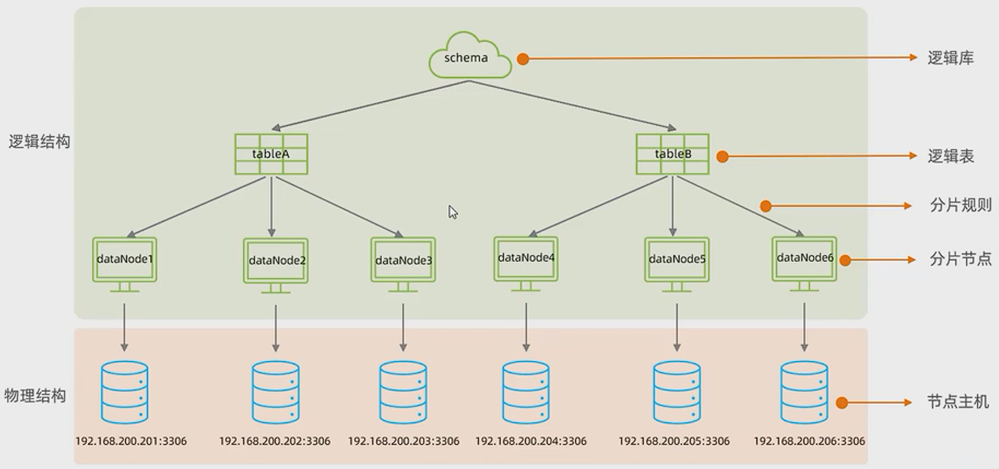

## 运维篇

### 日志

#### 错误日志

错误日志是MySQL中最重要的日志之一，它记录了当mysqld 启动和停止时，以及服务器在运行过程中发生任何严重错误时的相关信息。当数据库出现任何故障导致无法正常使用时，建议首先查看此日志。
该日志是默认开启的，默认存放目录/var/log/，默认的日志文件名为mysqld.log 。查看日志位置:

```sql
show variables like '%log_error%'
```

#### 二进制日志

二进制日志(BINLOG)记录了所有的DDL ( 数据定义语言)语句和DML (数据操纵语言)语句，但不包括数据查询(SELECT、 SHOW)语句。

**作用：**

- 灾难时的数据恢复;

- MySQL的主从复制。

在MySQL8版本中，默认二进制日志是开启着的，涉及到的参数如下:

```sql
show variables like '%log_bin%'
```

开启方法：https://blog.csdn.net/zwrlj527/article/details/93497918

**日志格式：**

MySQL服务器中提供了多种格式来记录进制日志，具体格式及特点如下:

| 日志格式  | 含义                                                         |
| --------- | ------------------------------------------------------------ |
| STATEMENT | 基于SQL语句的日志记录，记录的是SQL语句，对数据进行修改的SQL都会记录在日志文件中。 |
| ROW       | 基于行的日志记录，记录的是每一行的数据变更。(默认)           |
| MIXED     | 混合了STATEMENT和ROW两种格式，默认采用STATEMENT，在某些特殊情况下会自动切换为ROW进行记录。 |

```sql
show variables like '%binlog_format%';
```

**日志查看**

由于日志是以二进制方式存储的，不能直接读取，需要通过二进制日志查询工具mysqlbinlog来查看，具体语法:

```sql
mysqlbinlog -V 文件名 #基于行的日志记录
mysqlbinlog 文件名 #基于SQL语句的日志记录
```

**日志删除**

对于比较繁忙的业务系统，每天生成的binlog数据巨大，如果长时间不清除，将会占用大量磁盘空间。可以通过以下几种方式清理日志:

| 指令                                            | 含义                                                         |
| ----------------------------------------------- | ------------------------------------------------------------ |
| reset master                                    | 删除全部binlog日志，删除之后，日志编号，将从binlog.000001重新开始 |
| purge master logs to 'binlig.*********'         | 删除*****编号之前的所有日志                                  |
| purge master logs before 'yyy-mm-dd hh24:mi:ss' | 删除日志为"yyy-mm-dd hh24:mi:ss"之前产生的所有日志           |

也可以在mysql的配置文件中配置二进制日志的过期时间，设置了之后，二进制日志过期会自动删除。

```sql
show variables like '%binlog_expire_logs_seconds%';
show variables like '%expire_logs%';#低版本查询
```

#### 查询日志

查询日志中记录了客户端的所有操作语句，而二进制日志不包含查询数据的SQL语句。默认情况下，查询日志是未开启的。如果需要开启查询日志，可以设置以下配置:

```sql
show variables like '%general%'

#修改MySQL的配置文件/etc/my.cnf文件，添加如下内容:
#该选项用来开启查询日志，可选值: 0或者1 ; 0代表关闭，1代表开启
general_log=1
#设置日志的文件名，如果没有指定，默认的文件名为host_name.log
general_log_file=mysql_query.log
```

#### 慢查询日志

慢查询日志记录了所有执行时间超过参数long_query_time 设置值并且扫描记录数不小min_examined_row_limit
的所有的SQL语句的日志，默认未开启。long_query_ time 默认为10秒，最小为0，精度可以到微秒。

```sql
#慢查询日志
slow_query_log=1
#执行时间参数
long_query_time=2
```

默认情况下，不会记录管理语句，也不会记录不使用索引进行查找的查询。可以使用log_slow_admin_statements和更改此行为log_queries_not_using_indexes，如下所述。

```sql
#记录执行较慢的管理语句
log_slow_admin_statements =1 
#记录执行较慢的未使用索引的语句
log_queries_not_using_indexes = 1
```

### 主从复制

主从复制是指将主数据库（Master）的DDL和DML操作通过二进制日志传到从库服务器中，然后在从库（Slave）上对这些日志重新执行(也叫重做)，从而使得从库和主库的数据保持同步。

MySQL支持一台主库同时向多台从库进行复制，从库同时也可以作为其他从服务器的主库，实现链状复制。

MySQL复制的**优点**主要包含以下三个方面:

- 主库出现问题，可以快速切换到从库提供服务。
- 实现读写分离，降低主库的访问压力。
- 可以在从库中执行备份，以避免备份期间影响主库服务。

#### 原理


从上图来看，复制分成三步:
1. Master主库在事务提交时，会把数据变更记录在二进制日志文件Binlog中。
2. 从库读取主库的二进制日志文件Binlog，写入到从库的中继日志Relay Log。
3. Slave重做中继日志中的事件，将改变反映它自己的数据。

#### 搭建

**主库配置**

```sql
1.修改配置文件/etc/my.cnf

#mysql服务ID，保证整个集群环境中唯一，取值范围: 1 ~ 2^32-1，默认为1
server-id=1
#是否只读，1代表只读，0代表读写
read-only=0
#忽略的数据，指不需要同步的数据库
#binlog-ignore-db=mysql
#指定同步的数据库
#binlog-do-db=db01

2.重启数据库
systemctl restart mysqld

3.登录mysql，创建远程连接的账号，并授予主从复制权限
#创建itcast用户，并设置密码，该用户可在任意主机连接该MySQL服务
CREATE USER 'itcast'@'%' IDENTIFIED WITH mysql_native_password BY 'Root@123456';
#为'itcast'@'%'用户分配主从复制权限
GRANT REPLICATION SLAVE ON *.* TO 'itcast'@'%';

4.通过指令，查看二进制日志坐标，
show master status;

字段含义说明:
file :从哪个日志文件开始推送日志文件
position :从哪个位置开始推送日志
binlog_ignore_db :指定不需要同步的数据库
```

**从库配置**

```sql
1.修改配置文件/etc/my.cnf
#mysql服务ID，保证整个集群环境中唯一，取值范围: 1 ~ 2^32-1，默认为1
server-id=2
#是否只读，1代表只读，0代表读写(代表普通用户) super-read-only=1(超级用户)
read-only=1

2.重启数据库
systemctl restart mysqld

3.登录mysql,设置主库配置
CHANGE REPLICATION SOURCE TO
SOURCE_HOST='xxx.xxx',SOURCE_USER='xxx',SOURCE_PASSWORD='xxx',SOURCE_LOG_FILE='xxx', SOURCE_LOG_POS=xxx;
上述是8.0.23中的语法。如果mysql是8.0.23之前的版本，执行如下SQL: 
CHANGE MASTER TO MASTER_HOT='xxx.xxx.xxx.xxx', MASTER_USER='xxx',MASTER_PASSWORD='xxx', MASTER_LOG_FlLE='xxx',MASTER_LOG_POS=xxx;

#列
CHANGE REPLICATION SOURCE TO
SOURCE_HOST='192.168.200.200',SOURCE_USER='itcast',SOURCE_PASSWORD='Root@123456',SOURCE_LOG_FILE='binlog.000004',SOURCE_LOG_POS=663;

4.开启同步操作
start replica; #8.0.22之后
start slave; #8.0.22之前
```

#### 测试

```sql
#1.在主库上创建数据库、表，并插入数据
create database db01;
use db01;

create table tb user(
	id int(11) primary key not null auto_increment,
	name varchar(50) not nul,
	sex varchar(1)
) engine=innodb default charset=utf8mb4;

insert into tb_user(id,name,sex) 
values(null,'Tom','1'),(null,'Trigger','0'),(nll,'Dawn','1');
```

### 分库分表

随着互联网及移动互联网的发展，应用系统的数据量也是成指数式增长，若采用单数据库进行数据存储，存在以下性能瓶颈:
- IO瓶颈：热点数据太多，数据库缓存不足，产生大量磁盘I0，效率较低。请求数据太多，带宽不够，网络IO瓶颈。

- CPU瓶颈：排序、分组、连接查询、聚合统计等SQL会耗费大量的CPU资源，请求数太多，CPU出现瓶颈。

分库分表的中心思想都是将数据分散存储，使得单一数据库/表的数据量变小来缓解单一数据库的性能问题，从而达到提升数据库性能的目的。

#### 拆分策略

**垂直拆分**

垂直分库：以表为依据，根据业务将不同表拆分到不同库中。

特点:

- 每个库的表结构都不一样。
- 每个库的数据也不一样。
- 所有库的并集是全量数据。

垂直分表：以字段为依据，根据字段属性将不同字段拆分到不同表中。
特点:

- 每个表的结构都不一样。
- 每个表的数据也不一样，一般通过一列(主键/外键)关联。
- 所有表的并集是全量数据。

**水平拆分**

水平分库：以字段为依据，按照一定策略，将一个库的数据拆分到多个库中。
特点:

- 每个库的表结构都一样。

- 每个库的数据都不一样。
- 所有库的并集是全量数据。

水平分表：以字段为依据，按照一定策略，将一个表的数据拆分到多个表中。
特点：

- 每个表的表结构都一样。
- 每个表的数据都不一样。
- 所有表的并集是全量数据 。

**实现技术**

shardingJDBC：基于AOP原理，在应用程序中对本地执行的SQL进行拦截，解析、改写、路由处理。需要自行编码配置实现，只支持java语言，性能较高。

MyCat：数据库分库分表中间件，不用调整代码即可实现分库分表，支持多种语言，性能不及前者。

#### MyCat

Mycat是开源的、活跃的、基于Java语言编写的MySQL数据库中间件。可以像使用mysql一样来使用mycat，对于开发人员来说根本感觉不到mycat的存在。



#### 分片规则

是负载均衡的意思吗？

**范围**

根据指定的字段及其配置的范围与数据节点的对应情况，来决定该数据属于哪一个分片。

**取模**

根据指定的字段值与节点数量进行求模运算，根据运算结果，来决定该数据属于哪一个分片。

**一致性hash**

**枚举**

通过在配置文件中配置可能的枚举值，指定数据分布到不同数据节点上，本规则适用于按照省份、性别、状态拆分数据等业务。

**应用指定**

运行阶段由应用自主决定路由到那个分片，直接根据字符子串(必须是数字)计算分片号。

**固定分片hash算法**

该算法类似于十进制的求模运算，但是为二进制的操作，例如，取id的二进制低10位与11111111进行位&运算。

**字符串hash解析**

截取字符串中的指定位置的子字符串，进行hash算法，算出分片。

**按天分片**

**自然月**

使用场景为按照月份来分片，每个自然月为一个分片。

#### MyCat监控与管理

​	           解析SQL -> 分片分析 -> 路由分析 -> 读写分离分析

客户端	                                                                                        服务端

​	             分页处理 <- 排序处理 <- 聚合处理 <- 结果合并

**Mycat管理**

Mycat默认开通2个端口，可以在server.xml中进行修改。

- 8066 数据访问端口，即进行DML和DDL操作。
- 9066 数据库管理端口，即mycat服务管理控制功能，用于管理mycat的整个集群状态

| 命令              | 含义                        |
| ----------------- | --------------------------- |
| show @@help       | 查看Mycat管理工具帮助文档   |
| show @@version    | 查看Mycat的版本             |
| reload @@config   | 重新加载Mycat的配置文件     |
| show @@datasource | 查看Mycat的数据源信息       |
| show @@datanode   | 查看MyCat现有的分片节点信息 |
| show @@threadpool | 查看Mycat的线程池信息       |
| show @@sql        | 查看执行的SQL               |
| show @@sql.sum    | 查看执行的SQL统计           |

**Mycat-eye监控工具**

Mycat-web(Mycat-eye)是对mycat-server提供监控服务，功能不局限于对mycat-server使用。他通过JDBC连接对

Mycat、Mysql监控，监控远程服务器(目前仅限于linux系统)的cpu、内存、网络、磁盘。

Mycat-eye运行过程中需要依赖zookeeper，因此需要先安装zookeeper。

### 读写分离

读写分离，简单地说是把对数据库的读和写操作分开，以对应不同的数据库服务器。主数据库提供写操作，从数据库提供读操作，这样能有效地减轻单台数据库的压力。
通过MyCat即可轻易实现上述功能，不仅可以支持MySQL，也可以支持Oracle和SQL Server。

MySQL的主从复制，是基于二进制日志(binlog) 实现的。


利用MyCat来配置主从分离

schema.xml里面balance参数

| 参数值 | 含义                                                         |
| ------ | ------------------------------------------------------------ |
| 0      | 不开启读写分离机制，所有读操作都发送到当前可用的writeHost上  |
| 1      | 全部的readHost与备用的writeHost都参与select语句的负载均衡(主要针对于双主双从模式) |
| 2      | 所有的读写操作都随机在writeHost，readHost上分发              |
| 3      | 所有的读请求随机分发到writeHost对应的readHost上执行，writeHost不负担读压力 |

 #### 一主一从

#### 双主双从

一个主机Master1用于处理所有写请求，它的从机Slave1和另一台主机Master2还有它的从机Slave2负责所有读请求。当Master1主机宕机后，Master2 主机负责写请求，Master1 、Master2 互为备机。

```sql
#第一个主库配置
1.修改配置文件/etc/my.cnf
#mysql服务ID，保证整个集群环境中唯一，取值范围: 1 - 2^32-1，默认为1
server-id=1
#指定同步的数据库
binlog-do-db=db01
binlog-do-db=db02
binlog-do-db=db03
#在作为从数据库的时候，有写入操作也要更新二进制日志文件
log-slave-updates

2.重启MySQL服务器
systemctl restart mysqld


#第二个主库配置
3.修改配置文件/etc/my.cnf
#mysql服务ID，保证整个集群环境中唯一，取值范围: 1 - 2^32-1，默认为1
server-id=3
#指定同步的数据库
binlog-do-db=db01
binlog-do-db=db02
binlog-do-db=db03
#在作为从数据库的时候，有写入操作也要更新二进制日志文件
log-slave-updates

4.重启MySQL服务器
systemctl restart mysqld

5.创建用户账号并分配权限
CREATE USER 'itcast'@'%' IDENTIFIED WITH mysql_native_password BY 'Root@123456';
#为'itcast'@'%'用户分配主从复制权限
GRANT REPLICATION SLAVE ON *.* TO 'itcast'@'%';

#第一个从库配置
6.修改配置文件/etc/my.cnf
#mysql服务ID，保证整个集群环境中唯一，取值范围: 1 - 2^32-1，默认为1
server-id=2

7.重启MySQL服务器
systemctl restart mysqld

#第二个从库配置
8.修改配置文件/etc/my.cnf
#mysql服务ID，保证整个集群环境中唯一，取值范围: 1 - 2^32-1，默认为1
server-id=4

9.重启MySQL服务器
systemctl restart mysqld

10.在从库中设置关联的主库
CHANGE REPLICATION SOURCE TO
SOURCE_HOST='xxx.xxx',SOURCE_USER='xxx',SOURCE_PASSWORD='xxx',SOURCE_LOG_FILE='xxx', SOURCE_LOG_POS=xxx;
上述是8.0.23中的语法。如果mysql是8.0.23之前的版本，执行如下SQL: 
CHANGE MASTER TO MASTER_HOT='xxx.xxx.xxx.xxx', MASTER_USER='xxx',MASTER_PASSWORD='xxx', MASTER_LOG_FlLE='xxx',MASTER_LOG_POS=xxx;

11.两台主库之间主从复制
CHANGE MASTER TO MASTER_HOT='xxx.xxx.xxx.xxx', MASTER_USER='xxx',MASTER_PASSWORD='xxx', MASTER_LOG_FlLE='xxx',MASTER_LOG_POS=xxx;
```

**双主双从读写分离**

MyCat控制后台数据库的读写分离和负载均衡由schema.xmI文件datahost标签的balance属性控制，通过writeType及switchType来完成失败自动切换的。

**balance="1"**

代表全部的readHost与stand by writeHost参与select语句的负载均衡，简单的说，当双主双从模式(M1->S1, M2->S2, 并且M1与M2互为主备)，正常情况下，M2,S1,S2 都参与select语句的负载均衡;
**writeType**

0：写操作都转发到第1台writeHost， writeHost1挂了，会切换到writeHost2上;
1：所有的写操作都随机地发送到配置的writeHost上;
**switchType**

-1：不自动切换
1：自动切换