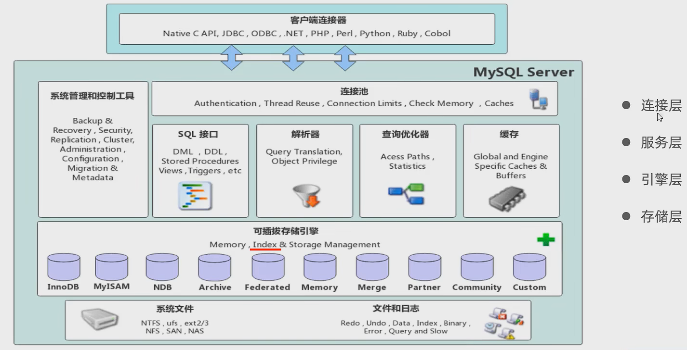
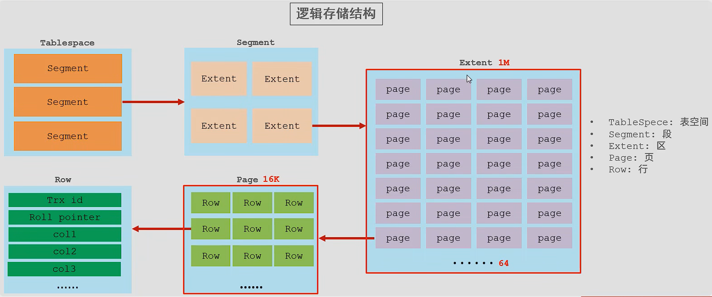
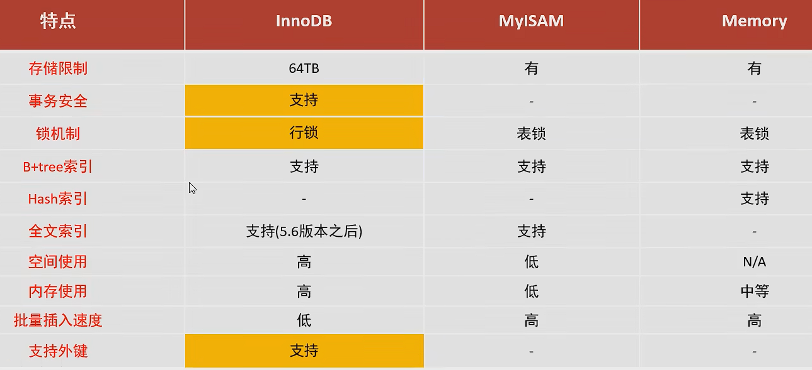
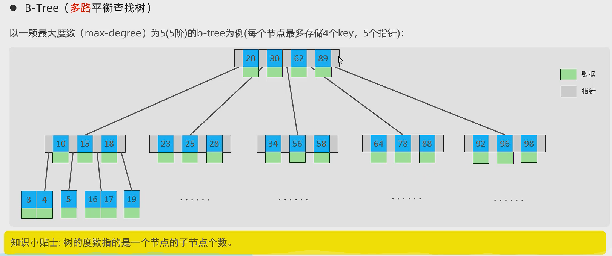
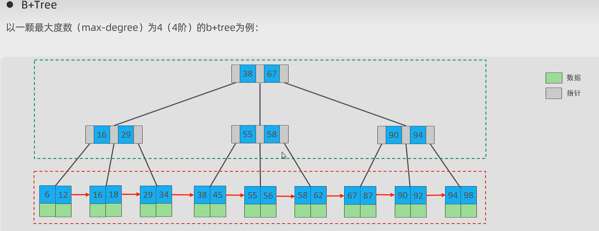
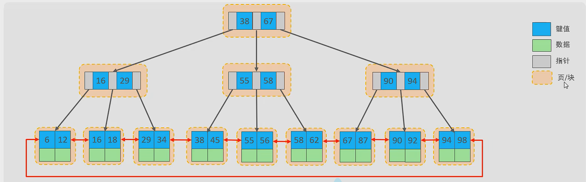
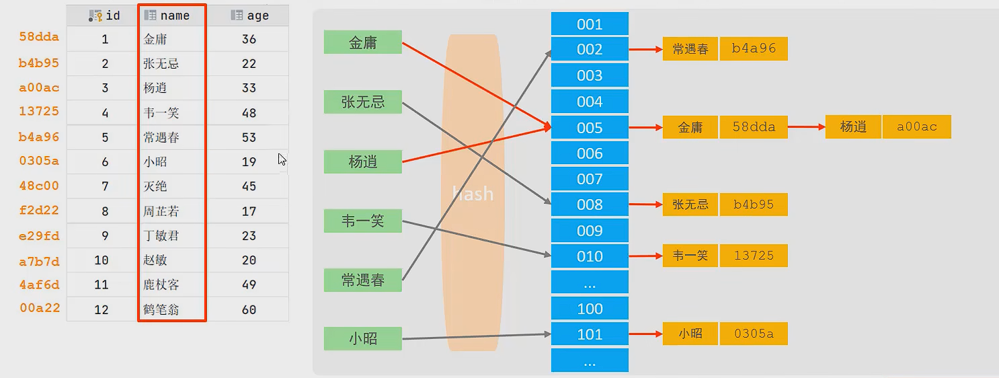
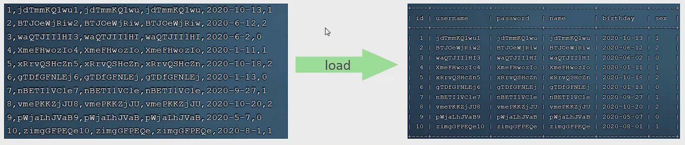
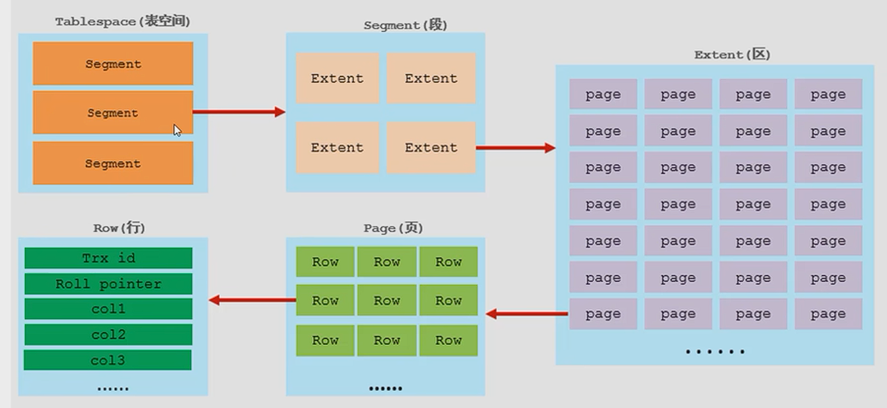
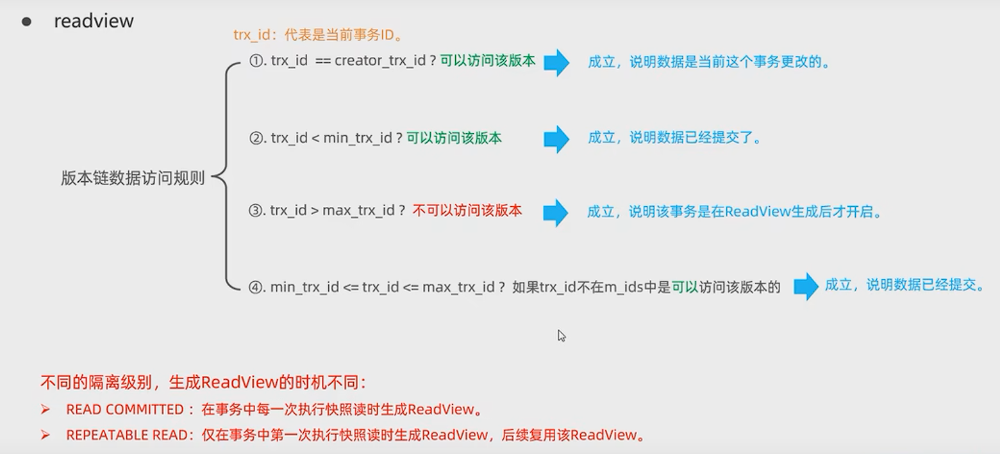

### MySql体系结构



#### 连接层

最上层是一些客户端和链接服务，主要完成一些类似于连接处理、授权认证、及相关的安全方案。服务器也会为安全接入的每个客户端验证它所具有的操作权限。

#### 服务层

第二层架构主要完成大多数的核心服务功能，如SQL接口，并完成缓存的查询，SQL的分析和优化，部分内置函数的执行。所有跨存储引擎的功能也在这一层实现， 如过程、函数等。
#### 引擎层
存储引擎真正的负责了MySQL中数据的存储和提取，服务器通过API和存储引擎进行通信。不同的存储引擎具有不同的功能，这样我们可以根据自己的需要，来选取合适的存储引擎。
#### 存储层
主要是将数据存储在文件系统之上，并完成与存储引擎的交互。

### 存储引擎

> 存储引擎就是存储数据、建立索引、更新/查询数据等技术的实现方式。存储引擎是基于表的，而不是基于库的，所以存储引擎也可被称为表类型。

```sql
SHOW create table account;#查询该表的存储引擎

SHOW ENGINES;#查询当前数据库支持的存储引擎

CREATE TABLE my_myisam(
	id int,
	name VARCHAR(10)
)ENGINE = INNODB;#默认InnoDB
```

#### InnoDB

> InnoDB是一种兼顾 高可靠性和高性能的通用存储引擎，在MySQL 5.5之后，InnoDB是默认的MySQL存储引擎。

##### 特点

1. DML操作遵循ACID模型，支持事务;

2. 行级锁，提高并发访问性能;

3. 支持外键FOREIGN KEY约束，保证数据的完整性和正确性;

##### 文件

XXX.ibd: xxx代表的是表名，innoDB引擎的每张表都会对应这样一个表空间文件， 存储该表的表结构(frm、 sdi) 、数据和索引。

参数: innodb_file_per_table#开启后一个表对应一个表空间，否则共享表空间

```sql
SHOW VARIABLES LIKE 'innodb_file_per_table';#NO
#我的Mysql版本 5.7.36
```

##### 逻辑存储结构



#### MyISAM

> MyISAM是MySql早期的默认存储引擎

##### 特点

不支持事务，不支持外键

支持表锁，不支持行锁

访问速度快

##### 文件

xxx.sdi: 存储表结构信息

xxx.MYD: 存储数据

xxx.MYI: 存储索引

#### Memory

> Memory引擎的表数据时存储在内存中的，由于受到硬件问题、或断电问题的影响，只能将这些表作为临时表或缓存使用。

##### 特点

内存存放

hash索引( 默认)

##### 文件

xxx.sdi:存储表结构信息



#### 存储引擎选择

> 在选择存储引擎时，应该根据应用系统的特点选择合适的存储引擎。对于复杂的应用系统，还可以根据实际情况选择多种存储引擎进行组合。

**InnoDB:** 是Mysq|的默认存储引擎，**支持事务、外键**。如果应用对事务的完整性有比较高的要求，在并发条件下要求数据的一致性，数据操作除了插入和查询之外，还包含很多的更新、删除操作，那么InnoDB存储引擎是比较合适的选择。

**MyISAM:** 如果应用是以读操作和插入操作为主，只有很少的更新和删除操作，并且对事务的完整性、并发性要求不是很高，那么选择这个存储引擎是非常合适的。（日志，评论）

**MEMORY:** 将所有数据保存在内存中，**访问速度快，通常用于临时表及缓存**。MEMORY的缺陷就是对表的大小有限制，太大的表无法缓存在内存中，而且无法保障数据的安全性。

### 索引

>索引(index) 是帮助MySQL高效获取数据的数据结构(有序)。在数据之外，数据库系统还维护着满足特定查找算法的数据结构，这些数据结构以某种方式引用(指向)数据，这样就可以在这些数据结构上实现高级查找算法,这种数据结构就是索引。
>
>通俗来说，索引相当于目录，书签，它使人能够快速访问自己想要翻阅的内容。

#### 优点

1. 有索会提高数据检索的效率，降低数据库的I0成本；没有就会进行全表扫描效率低。

2. 通过索引对数据进行排序，降低数据排序成本，降低CPU消耗

#### 缺点

1. 索引列也是要占用空间的。

2. 索引大大提高了查询效率,同时却也降低更新表的速度，如对表进行INSERT、UPDATE、DELETE时，效率降低。

#### 索引结构

##### B+Tree索引

最常见的索引类型，大部分引擎都支持B+树索引

##### Hash索引

底层数据结构是用哈希表实现的，只有精确匹配索引列的查询才有效，不支持范围查询

##### R- tree(空间索引)

空间索引是MyISAM引擎的一个特殊索引类型， 主要用于地理空间数据类型，通常使用较少

##### Full-text(全文索引)

是一种通过建立倒排索引,快速匹配文档的方式。类似于Lucene,Solr,ES

| 索引           | InnoDB          | MylSAM | Memory |
| -------------- | --------------- | ------ | ------ |
| **B+tree索引** | 支持            | 支持   | 支持   |
| Hash索引       | 不支持          | 不支持 | 支持   |
| R-tree索引     | 不支持          | 支持   | 不支持 |
| Full-text      | 5.6版本之后支持 | 支持   | 不支持 |

##### B树索引



##### B+树



与B树的区别：

1. 所有的数据都会出现在叶子节点
2. 叶子节点形成一个单向链表

##### MySql优化了B+Tree树

Mysql索引数据结构对经典的B+Tree进行了优化。在原B+树的基础上，增加一个指向相邻叶子节点的链表指针，就形成了带有顺序指针的B+Tree，提高区间访问的性能。（循环双向链表）



##### Hash索引

哈希索引就是采用一定的hash算法，将键值换算成新的hash值，映射到对应的槽位上，然后存储在hash表中。



**特点**

1. Hash索 引只能用于对等比较(=，in)， 不支持范围查询(between, >，<，.. 

2. 无法利用索引完成排序操作

3. 查询效率高， 通常只需要一次检索就可以了，效率通常要高于B+tree索引

**存储引擎支持**

在MySQL中，支持hash索引的是Memory引擎，而InnoDB中 具有自适应hash功能，hash索引是存储引擎根据B+Tree索引在指定条件下自动构建的。

为什么InnoDB存储引擎选择使用B+tree索引结构?

1. 相对于二叉树，层级更少，搜索效率高，而且二叉树会退化为链表
2. 对于B-tree,无论是叶子节点还是非叶子节点，都会保存数据，这样导致一页中存储的键值减少，指针跟着减少，要同样保存大量数据,只能增加树的高度，导致性能降低
3. 相对Hash索引，B+tree支持范围匹配及排序操作

#### 索引分类

| 分类     | 含义                                                 | 特点                     | 关键字   |
| -------- | ---------------------------------------------------- | ------------------------ | -------- |
| 主键索引 | 针对于表中主键创建的索引                             | 默认自动创建，只能有一个 | PRIMARY  |
| 唯一索引 | 避免同一个表中某数据列中的值重复                     | 可以有多个               | UNIQUE   |
| 常规索引 | 快速定位特定数据                                     | 可以有多个               |          |
| 全文索引 | 全文索引查找的是文本中的关键词，而不是比较索引中的值 | 可以有多个               | FULLTEXT |

根据索引的存储形式进行分类

| 分类                      | 含义                                                       | 特点                |
| ------------------------- | ---------------------------------------------------------- | ------------------- |
| 聚集索引(Clustered Index) | 将数据存储与索引放到了一块，索引结构的叶子节点保存了行数据 | 必须有,而且只有一个 |
| 二级索引(Secondary Index) | 将数据与索引分开存储，索引结构的叶子节点关联的是对应的主键 | 可以存在多个        |

**聚集索引选取规则:**

1. 如果存在主键，主键索引就是聚集索引。

2. 如果不存在主键，将使用第一个唯一(UNIQUE)索引作为聚集索引。

3. 如果表没有主键，或没有合适的唯一索引， 则InnoDB会自动生成一个rowid作为隐藏的聚集索引。

**回表查询**：先走二级索引找到对应主键值，再根据主键值走聚集索引拿到对应的行数据（按B+Tree数查找方式）。

#### 思考题

1. 以下SQL语句，那个执行效率高?为什么?

```sql
select * from user where id= 10;#来自用户，其中id=10

select * from user where name= 'Arm';#从名称=‘Arm’的用户处选择

#备注: id为主键，name字段创建的有索引;
#第一句效率高，只需要查询聚集索引，而第二句需要进行回表查询
```

2. InnoDB主键索引的B+tree高度为多高呢?

#### 索引语法

**创建索引**

```sql
CREATE [UNIQUE|FULLTEXT] INDEX index_name ON table_name (index_col_name,...);
```

**查看索引**

```sql
SHOW INDEX FROM table_name ;
```

**删除索引**

```sql
DROP INDEX index_name ON table_name;
```

#### SQL性能分析

##### SQL执行频率

MySQL客户端连接成功后，通过show [session|global] status命令可以提供服务器状态信息。通过如下指令，可以查看当前数据库的INSERT、UPDATE、DELETE、 SELECT的访问频次:

```sql
SHOW GLOBAL STATUS LIKE 'Com_______';#哪些指令使用频繁，就优化哪条
```

##### 慢查询日志

慢查询日志记录了所有执行时间超过指定参数(long_query_time, 单位:秒，默认10秒)的所有SQL语句的日志。

MySQL的慢查询日志默认没有开启，需要在MySQL的配置文件(/etc/my.cnf) 中配置如下信息: 

```sql
#开启MySQL慢日志查询开关
slow_query_log=1

#设置慢日志的时间为2秒，SQL 语句执行时间超过2秒，就会视为慢查询，记录慢查询日志
long_query_time=2
```

##### profile详情

show profiles能够在做SQL优化时帮助我们了解时间都耗费到哪里去了。通过have_profiling参数， 能够看到当前MySQL是否支持profile操作:

```sql
SELECT @@have_profiling;
```

默认profiling是关闭的，可以通过set语句在session/ global级别开启profiling：

```sql
show profile for query query_id;SELECT @@PROFILING#查看是否打开
SET profiling= 1;

show profiles;#查询当前会话执行的每一条sql语句耗时情况

show profile cpu for query query_id;#查询指定query_id的sql语句各个阶段的CPU耗时情况, 我的版本不支持
```

##### explain执行计划

EXPLAIN或者DESC命令获取MySQL如何执行SELECT语句的信息，包括在SELECT语句执行过程中表如何连接和连接的顺序。

语法：

```sql
#直接在select语句之前加上关键字explain/desc
EXPLAIN SELECT 字段列表 FROM 表名 WHERE 条件;
```

EXPLAIN执行计划各字段含义：

**Id**

select查询的序列号，表示查询中执行select子句或者是操作表的顺序(id相同，执行顺序从上到下; id不同，值越大，越先执行)。

**select_type**

表示SELECT的类型，常见的取值有SIMPLE (简单表，即不使用表连接或者子查询)、PRIMARY (主查询，即外层的查询)、UNION (UNION中的第二个或者后面的查询语句)、SUBQUERY (SELECT/WHERE之后包含了子查询)等

**type**

表示连接类型，性能由好到差的连接类型为NULL、system、 const、 eq_ref、 ref、range、index、 all 。

**possible_key** 

显示可能应用在这张表上的索引，一个或多个。

**Key**

实际使用的索引，如果为NULL,则没有使用索引。

**Key_len** 

表示索引中使用的字节数，该值为索引字段最大可能长度，并非实际使用长度，在不损失精确性的前提下，长度越短越好。

**rows**

MySQL认为必须要执行查询的行数，在innodb引擎的表中，是一个估计值，可能并不总是准确的。

**filtered**

表示返回结果的行数占需读取行数的百分比，filtered的值越大越好。

#### 索引的使用

##### 最左前缀法则

如果索引了多列(**联合索引**)，要遵守最左前缀法则。最左前缀法则指的是查询从索引的最左列开始，并且不跳过索引中的列。如果跳跃某一列，索引将部分失效(后面的字段索引失效)。前面使用范围查询（>）,后面字段索引会失效，可以使用>=或<=规避。

##### 索引失效情况

1. 不要在索引列上进行运算操作，否则索引将失效。
2. 字符串不加单引号，造成隐式转换故索引将失效。
3. 如果仅仅是尾部模糊匹配，索引不会失效。如果是头部模糊匹配，索引失效（%工程）。

4. 用or分割开的条件，如果or前的条件中的列有索引，而后面的列中没有索引，那么涉及的索引都不会被用到。

5. 如果MySQL评估使用索引比全表更慢，则不使用索引（取决于数据分布情况）。

##### SQL提示

SQL提示，是优化数据库的一个重要手段，简单来说，就是在SQL语句中加入一些人为的提示来达到优化操作的目的。

```sql
#use index:建议索引使用（Mysql不一定接收该建议）
explain select * from tb_ user use index(idx_user_pro) where profession= '软件工程';
#ignore index:指定忽略索引使用
explain select * from tb_ user ignore index(idx_user_pro) where profession = '软件工程';
#force index:强制使用该索引
explain select * from tb_ user force index(idx_user_pro) where profession= '软件工程;
```

##### 覆盖索引

尽量使用覆盖索引(查询使用了索引，并且需要返回的列，在该索引中已经全部能够找到)，减少select *。

**Extra参数内值含义**

using index condition:查找使用了索引，但是需要回表查询数据
using where; using index:查找使用了索引，但是需要的数据都在索引列中能找到，所以不需要回表查询数据

##### 前缀索引

当字段类型为字符串(varchar, text等)时，有时候需要索引很长的字符串，这会让索引变得很大，查询时，浪费大量的磁盘I0，影响查询效率。此时可以只将字符串的一部分前缀，建立索引，这样可以大大节约索引空间，从而提高索引效率。

```sql
create index idx_xxxx on table_name (column(n));
#column(n) 提取前n个字符
```

前缀长度

可以根据索引的选择性来决定，而选择性是指不重复的索引值( 基数)和数据表的记录总数的比值，索引选择性越高则查询效率越高。如唯一索引的选择性是1, 这是最好的索引选择性，性能也是最好的。

```
#查看字段的索引选择性
select count(email) / count(*) from tb_user;
select count(distinct substring(email, 1, 10)) / count(*) from tb_user;
```

##### 单列&联合索引

单列索引: 即一一个索引只包含单个列。
联合索引: 即一一个索引包含了多个列。

在业务场景中，如果存在多个查询条件，考虑针对于查询字段建立索引时，建议建立联合索引，而非单列索引。

**多条件联合查询时，MySQL优化器会评估哪个字段的索引效率更高，会选择该索引完成本次查询。**(除非强制使用)

##### 索引设计原则

- 针对于数据量较大，且查询比较频繁的表建立索引。
- 针对于常作为查询条件(where) 、排序(order by)、分组(group by)操作的字段建立索引。
- 尽量选择区分度高的列作为索引，尽量建立唯一索引，区分度越高，使用索引的效率越高。
- 如果是字符串类型的字段，字段的长度较长，可以针对于字段的特点，建立前缀索引。
- 尽量使用联合索引， 减少单列索引，查询时，联合索引很多时候可以覆盖索引，节省存储空间，避免回表，提高查询效率。
- 要控制索引的数量，索引并不是多多益善，索引越多，维护索引结构的代价也就越大，会影响增删改的效率。
- 如果索引列不能存储NULL值,请在创建表时使用NOT NULL约束它。当优化器知道每列是否包含NULL值时，它可以更好地确定哪个索引最有效地用于查询。

### SQL优化

#### 插入数据

**insert优化**

```sql
start transaction;
insert into tb_test values(1,'Tom'),(2,'cat'),(3,'jerry');
commit;
#建议批量插入，数据500~1000
#建议手动提交事务
#建议主键顺序插入
```



```sql
#大批量数据插入
#如果一次性需要插入大批量数据，使用insert语句插入性能较低，此时可以使用MySQL数据库提供的load指令进行插
#入。
#操作如下:
#客户端连接服务端时，加上参数--local-infile
mysql --local-infile -U root -p
#设置全局参数local infile为1，开启从本地加载文件导入数据的开关
set global local_infile= 1;
#执行load指令将准备好的数据，加载到表结构中
load data local infile '/root/sql1.log' into table tb_user fields terminated by ',' lines terminated by '\n';
#按主键顺序插入
```

#### 主键优化

**数据组织方式**
在InnoDB存储引擎中，表数据都是根据主键顺序组织存放的，这种存储方式的表称为索引组织表(index organized table I0T)。

**页分裂**

主键乱序插入会造成页分裂

**页合并**

当删除一行记录时，实际上记录并没有被物理删除，只是记录被标记(flaged) 为删除并且它的空间变得允许被其他记录声明使用。当页中删除的记录达到MERGE_THRESHOLD (合并页的阈值，默认为页的50%) ， InnoDB会开始寻找最靠近的页(前或后) 看看是否可以将两个页合并以优化空间使用。

**主键设计原则**

1. 满足业务需求的情况下，尽量降低主键的长度。
2. 插入数据时，尽量选择顺序插入，选择使用AUTO_INCREMENT自增主键。
3. 尽量不要使用UUID做主键或者是其他自然主键，如身份证号。

#### order by优化

Using filesort：通过表的索引或全表扫描，读取满足条件的数据行，然后在排序缓冲区sort buffer中完成排序操作，所有不是通过索引直接返回排序结果的排序都叫FileSort排序。
Using index：通过有序索引顺序扫描直接返回有序数据，这种情况即为using index，不需要额外排序，操作效率高。

```sql
create index idx_age_pho on tb_user(age asc, name desc);#默认升序asc
```

1. 根据排序字段建立合适的索引，多字段排序时，也遵循最左前缀法则。
2. 尽量使用覆盖索引。
3. 多字段排序，一个升序一个降序，此时需要注意联合索引在创建时的规则(ASC/DESC)
4. 如果不可避免的出现filesort，大数据量排序时，可以适当增大排序缓冲区大小sortlbuffer_size(默认256k)。

```sql
show variables like 'sort_buffer_size';
```

#### group by优化

建立索引。若group by 后字段满足最左前缀法则使用索引，不满足时可能需要使用索引+临时表

#### limit优化

一个常见又非常头疼的问题就是limit 2000000,10，此时需要MySQL排序前2000010记录，仅仅返回2000000 - 2000010的记录，其他记录丢弃，查询排序的代价非常大。

**优化**：覆盖索引 + 子查询

#### count优化

MylSAM引擎把一个表的总行数存在了磁盘上，因此执行count(*)的时候会直接返回这个数，效率很高（没有条件）。

InnoDB引擎就麻烦了，它执行count(*)的时候，需要把数据一行一·行地从引擎里面读出来，然后累积计数。

**优化**：自己加个计数字段吧。

**count的几种用法**
count()是一个聚合函数，对于返回的结果集，一行行地判断，如果count函数的参数不是NULL， 累计值就加1，否则不加，最后返回累计值。
用法: count (*) 、count (主键)、count (字段)、count (1)

1. count (主键)
   InnoDB引擎会遍历整张表，把每一行的主键id值都取出来，返回给服务层。服务层拿到主键后，直接按行进行累加(主键不可能为null)。
2. count(字段)
   没有not null约束: InnoDB引擎会遍历整张表把每一行的字段值都取出来，返回给服务层，服务层判断是否为null,不为null,计数累加。
   有not null约束: InnoDB 引擎会遍历整张表把每一行的字 段值都取出来，返回给服务层，直接按行进行累加。
3. count (1)
   InnoDB引擎遍历整张表，但不取值。服务层对于返回的每一行，放一个数字“1” 进去，直接按行进行累加。
4. count (*)
   InnoDB引擎并不会把全部字段取出来，而是**专门做了优化**，不取值，服务层直接按行进行累加。

按照效率排序的话，count(字段) < count(主键id) < count(1)≈count(\*)，所以尽量使用count(\*)。

#### update优化

没有索引加的是表锁

有索引加的是行锁

InnoDB的行锁是针对索引加的锁，不是针对记录加的锁，并且该索引不能失效，否则会从行锁升级为表锁。

尽量根据主键/索引字段进行数据更新

### 视图

>视图(View) 是一种虚拟存在的表。视图中的数据并不在数据库中实际存在，行和列数据来自定义视图的查询中使用的表，并且是在使用视图时动态生成的。
>通俗的讲，视图只保存了查询的SQL逻辑，不保存查询结果。所以我们在创建视图的时候，主要的工作就落在创建这条SQL查询语句上。

简单、安全、数据独立（业务代码不变，只需修改视图）。

#### 视图基本使用

```sql
#创建视图
#1.创建
CREATE [OR REPLACE] VIEW 视图名称[(列名列表)] AS SELECT语句 [WITH[CASCADED | LOCAL] CHECK OPTION]

create or replace view stu_v_1 as select id,name from emp where id <= 10;

#2.查询
#查看创建视图语句: SHOW CREATE VIEW视图名称
show create view stu_v_1

#查看视图数据: SELECT * FROM视图名称（和表操作一样）
select * from stu_v_1

#3.修改
#方式一: CREATE [OR REPLACE] VIEW 视图名称[(列名列表)] AS SELECT语句 [WITH[CASCADED | LOCAL] CHECK OPTION]
create or replace view stu_v_1 as select id,name,job from emp where id <= 10;
#方式二: ALTER VIEW视图名称[(列名列表)] AS SELECT语句 [WITH[CASCADED | LOCAL] CHECK OPTION]
alter view stu_v_1 as select id,name,salary from emp where id <= 10;

#4.删除
DROP VIEW [IF EXISTS]视图名称[视图名称]..
drop view if exists stu_v_1;
```

#### 视图检查选项

当使用WITH CHECK OPTION子句创建视图时，MySQL会通过视图检查正在更改的每个行，例如插入，更新，删除，以使其符合视图的定义。MySQL允许基于另个视图创建视图，它还会检查依赖视图中的规则以保持一 致性。为了确定检查的范围， mysql提供了两个选项: CASCADED和LOCAL，默认值为CASCADED。

CASCADED（级联的）：

```sql
alter view stu_v_1 as select id,name,salary from emp where id <= 10;

insert into stu_v_1(id, name)  values(20, 'dog');#不能插入，没满足条件id <= 10

create or replace view stu_v_2 as select id,name from stu_v_1 where id > 5 with CHECK OPTION;#会检查当前视图所依赖的所有视图是否满足，不管依赖的视图是否加了with check option，因为会传递下去，但只往下传递

insert into stu_v_2(id, name)  values(20, 'miqi');
```

LOCAL

```sql
create view v1 as select id,name from emp where id <= 15;

create view v2 as select id,name from v1 where id >= 5 with local check option;

insert into v2(id, name)  values(24, 'miqi');
#不会传递下去，只会递归检查，没有加with check option 就可以不检查
```

#### 视图更新 

要使视图可更新，视图中的行与基础表中的行之间必须存在一对一的关系。如果视图包含以下任何一项，则该视图不可更新:

1. 聚合函数或窗口函数(SUM()、 MIN()、 MAX()、 COUNT()等)
2. DISTINCT
3. GROUP BY
4. HAVING
5. UNION 或者UNION ALL

**视图作用**

1. 简单
   视图不仅可以简化用户对数据的理解，也可以简化他们的操作。那些被经常使用的查询可以被定义为视图，从而使得用户不必为以后的操作每次指定全部的条件。

2. 安全

   数据库可以授权，但不能授权到数据库特定行和特定的列上。通过视图用户只能查询和修改他们所能见到的数据。

3. 数据独立
   视图可帮助用户屏蔽真实表结构变化带来的影响。

### 存储过程

>存储过程是事先经过编译并存储在数据库中的一段SQL语句的集合，调用存储过程可以简化应用开发人员的很多工作，减少数据在数据库和应用服务器之间的传输，对于提高数据处理的效率是有好处的。
>存储过程思想上很简单，就是数据库SQL语言层面的代码封装与重用。

**特点**

1. 封装，复用。
2. 可以接收参数，也可以返回数据。
3. 减少网络交互，效率提升。

**创建**

```sql
CREATE PROCEDURE 存储过程名称([参数列表])

BEGIN
   #SQL语句
END;
```

**调用**

```sql
CALL 名称 ([参徽]);
```

```sql
#示列
create procedure p1()
begin
	select count(*) from emp;
end;

#命令行声明
#设置命令行sql语句结束符
delimiter $$
create procedure p1()
begin
	select count(*) from emp;
end$$

#调用
call p1();
```

**查看**

```sql
#查询指定数据库的存储过程及状态信息
SELECT * FROM INFORMATION_SCHEMA.ROUTINES WHERE ROUTINE_SCHEMA = 'xxx';

select * from information_schema.ROUTINES where ROUTINE_SCHEMA = 'itcast';

#查询某个存储过程的定义
SHOW CREATE PROCEDURE 存储过程名称

show create PROCEDURE p1;
```

**删除**

```sql
DROP PROCEDURE [IF EXISTS] 存储过程名称;

drop procedure if exists p1;
```

#### 系统变量

> 系统变量是MySQL服务器提供，不是用户定义的，属于服务器层面。
>
> 分为全局变量(GLOBAL)、 会话变量 (SESSION)。

```sql
#查看系统变量
SHOW [SESSION|GLOBAL] VARIABLES;#查看所有系统变量
SHOW [SESSION|GLOBAL] VARIABLES LIKE .... #可以通过IKE模糊匹配方式查找变量
SELECT @@[SESSION|GLOBAL] 系统变量名;#查看指定变量的值

show VARIABLES;#默认session
show global VARIABLES;

show global VARIABLES like 'auto%';

select @@autocommit;
select @@global.autocommit;

#设置系统变量
SET [SESSION|GLOBAL] 系统变量名=值;
SET @@[SESSION|GLOBAL].系统变量名=值;

set session autocommit = 0;
set @@session.autocommit = 0;
```

#### 用户自定义变量

>用户定义变量是用户根据需要自己定义的变量，用户变量不用提前声明，在用的时候直接用“@变量名”使用就可以。其作用域为当前连接。
>
>用户定义的变量无需对其进行声明或初始化，只不过获取到的值为NULL。
>
>如：select @abc

**赋值**

```sql
SET @var_ name = expr [,@var_ name = expr]...;
SET @var_ name := expr [,@var_ name := expr]...;#推荐使用这个
SELECT @var_ name := expr [,@var_ name := expr]...;
SELECT 字段名 INTO @var_name FROM 表名;

select count(*) into @count_people from emp;
select @count_people

set @myname = 'itcast';
set @myage := 10;
set @mygender := '男', @myhobby := 'java' 

#使用
SELECT @var_name;
select @myname, @myage, @mygender, @myhobby;
```

#### 局部变量

>局部变量是根据需要定义的在局部生效的变量，访问之前，需要DECLARE声明。可用作存储过程内的局部变量和输入参数，局部变量的范围是在其内声明的BEGIN ... END块。

**声明**

```sql
DECLARE 变量名 变量类型[DEFAULT ...];
#变量类型就是数据库字段类型: INT、BIGINT、 CHAR、 VARCHAR、DATE、TIME等
```

**赋值**

```sql
SET 变量名 = 值;
SET 变量名 := 值;
SELECT 字段名 INTO 变量名 FROM 表名 ...;

#列子
create procedure p2()
begin
 declare emp_count int default 0;
 select count(*) into emp_count from emp;
 select emp_count;
end;
```

#### IF

```sql
IF 条件1 THEN
 ...
ELSEIF 条件2 THEN #可选
 ...
ELSE #可选
 ...
END IF;
```

```sql
create procedure p3()
begin
	declare score int default 58;
	declare result varchar(10);
	if score >= 85 then
		set result := '优秀';
	elseif score >= 60 then
		set result := '及格';
	else
		set result := '不及格';
	end if;
	select result;
end;
```

#### 参数

| 类型  | 含义                                         | 备注 |
| ----- | -------------------------------------------- | ---- |
| IN    | 该类参数作为输入，也就是需要调用时传入值     | 默认 |
| OUT   | 该类参数作为输出，也就是该参数可以作为返回值 |      |
| INOUT | 既可以作为输入参数，也可以作为输出参数       |      |

```sql
CREATE PROCEDURE 存储过程名称([IN/OUT/INOUT 参数名 参数类型])

BEGIN
#SQL语句

END;

#列子

#根据传入(in)参数score，判定当前分数对应的分数等级，并返回(out)。
#score >= 85分，等级为优秀。
#score >= 60分 且 score < 85分，等级为及格。
#score < 60分，等级为不及格。
create procedure p4(in score int, out result varchar(10))
begin
	if score >= 85 then
		set result := '优秀';
	elseif score >= 60 then
		set result := '及格';
	else
		set result := '不及格';
	end if;
end;

call p4(99, @result);
select @result;

#将传入的200分制的分数，进行换算，换算成百分制，然后返回分数 ---> inout
create procedure p5(inout score double)
begin
	set score := score * 0.5;
end;

set @score = 78;
call p5(@score);
select @score;
```

#### case

```sql
#语法一
CASE case_value
	WHEN when_valuel THEN statement_list 1
	[WHEN when_value2 THEN statement_list 2]...
	[ELSE statement_list ]
END CASE;

#语法二
CASE
	WHEN search_condition1 THEN statement_list1
	[WHEN search_condition2 THEN statement_list2]...
	[ELSE statement_list]
END CASE;
```

 ```sql
#case
#根据传入的月份，判定月份所属的季节(要求采用case结构)
#1-3月份，为第一季度
#4-6月份，为第二季度
#7-9月份，为第三季度
#10-12月份，为第四季度
create procedure p6(in month int)
begin

	declare result varchar(10);
	
	case 
		when month >= 1 and month <= 3 then
			set result := '第一季度';
		when month >= 4 and month <= 6 then
			set result := '第二季度';
		when month >= 7 and month <= 9 then
			set result := '第三季度';
		when month >= 10 and month <= 12 then
			set result := '第四季度';
		else
			set result := '非法参数';
	end case;
		
	select concat('月份：', month, ' 季度：', result);
		
end;
 ```

#### while

> while 循环是有条件的循环控制语句。满足条件后，再执行循环体中的SQL语句。

```sql
#具体语法为:
#先判定条件，如果条件为true，则执行逻辑，否则，不执行逻辑
while 条件 DO
	SQL逻辑..
END while;

#计算1到n的值，n为传入的参数值

create procedure p7(in n int)
begin
	declare total int default 0;
	while n > 0 do
		set  total = total + n;
		set n = n - 1;
	end while;
	select total;
end;

call p7(100);
```

#### repeat

> 是有条件的循环控制语句,当满足条件的时候退出循环。具体语法为:

```sql
#先执行一次逻辑，然后判定逻辑是否满足，如果满足，则退出。如果不满足，则继续下一次循环
REPEAT
	SQL逻辑..
	UNTIL 条件
END REPEAT;

#计算1到n的值，n为传入的参数值
create procedure p8(in n int)
begin
	declare total int default 0;
	repeat
		set total = total + n;
		set n = n - 1;
	until n <= 0
	end repeat;
	select total;
end;
```

#### loop

>LOOP实现简单的循环，如果不在SQL逻辑中增加退出循环的条件，可以用其来实现简单的死循环。LOOP可以配合一下两个语句使用:
>	LEAVE：配合循环使用，退出循环。
>	ITERATE： 必须用在循环中，作用是跳过当前循环剩下的语句，直接进入下一次循环。

```sql
[begin_label:] LOOP
	SQL逻辑...
END LOOP [end_label];

LEAVE label; #退出指定标记的循环体
ITERATE label;#直接进入下一次循环
```

```sql
# 计算从1累加到n的值，n为传入的参数值。
create procedure p9(in n int)
begin
	declare total int default 0;
	sum:loop
	
		if n <= 0 then
			leave sum;
		end if;
		
		set total = total + n;
		set n = n - 1;
	end loop sum;
	select total;
end;

# 计算从1到n之间的偶数累加的值，n为传入的参数值。
create procedure p10(in n int)
begin
	declare total int default 0;
	sum:loop
	
		if n <= 0 then
				leave sum;
		end if;
		
		if n % 2 = 1 then
			set n = n - 1;
			iterate sum;
		end if;
		
		set total = total + n;
		set n = n - 1;
	end loop sum;
	select total;
end;
```

#### cursor游标

>游标(CURSOR)是用来存储查询结果集的数据类型,在存储过程和函数中可以使用游标对结果集进行循环的处理。游标的使用包括游标的声明、OPEN、FETCH 和CLOSE，其语法分别如下。

**声明游标**

```sql
DECLARE 游标名称 CURSOR FOR 查询语句;
```

**打开游标**

```sql
OPEN 游标名称;
```

**获取游标记录**

```sql
FETCH 游标名称 INTO 变量[,变量];
```

**关闭游标**

```sql
CLOSE 游标名称;
```

**条件处理程序**

>条件处理程序(Handler) 可以用来定义在流程控制结构执行过程中遇到问题时相应的处理步骤。具体语法为:

```sql
DECLARE handler_action HANDLER FOR condition_value [,condition_value]... statement;
handler_action
	CONTINUE: 继续执行当前程序
	EXIT: 终止执行当前程序
condition_value
	SQLSTATE sqlstate_value: 状态码，如02000
	SQLWARNING: 所有以01开头的SQLSTATE代码的简写
	NOT FOUND: 所有以02开头的SQLSTATE代码的简写
	SQLEXCEPTION: 所有没有被SQLWARNING或NOT FOUND捕获的SQLSTATE代码的简写
```

```sql

create procedure p11(in uage int)
begin
	declare uname varchar(10);
	declare job varchar(10);
	declare u_cursor cursor for select name,job from emp where age <= uage;
	#条件处理程序
	#declare exit handler for sqlstate '02000' close u_cursor;
	declare exit handler for not found close u_cursor;
	
	
	drop table if exists tb_emp_pro;
	create table if not exists tb_emp_pro(
		id int primary key auto_increment,
		name varchar(10),
		job varchar(10)
	);
	
	open u_cursor;
	
	while true do
		fetch u_cursor into uname,job;
		insert into tb_emp_pro values(null, uname, job);
	end while;
	
	close u_cursor;
	
end;
```

### 存储函数

> 存储函数是有返回值的存储过程，存储函数的参数只能是IN类型的。具体语法如下:

```sql
CREATE FUNCTION 存储函数名称([参数列表])
RETURNS type [characteristic ...]
BEGIN
 	#SQL语句
	RETURN....;
END;

characteristic说明:
	DETERMINISTIC: 相同的输入参数总是产生相同的结果
	NO SQL: 不包含SQL语句。
	READS SQL DATA: 包含读取数据的语句，但不包含写入数据的语句。
```

```sql
#mysql5.7不需要
#returns int deterministic
create function fun1(n int)
returns int
begin

	declare total int default 0;
	while n > 0 do
		set  total = total + n;
		set n = n - 1;
	end while;
	
	return total;
end;
```

### 触发器

>触发器是与表有关的数据库对象，指在insert/update/delete之前或之后，触发并执行触发器中定义的SQL语句集合。触发器的这种特性可以协助应用在数据库端确保数据的完整性，日志记录，数据校验等操作。
>使用别名OLD和NEW来引用触发器中发生变化的记录内容，这与其他的数据库是相似的。现在触发器还只支持行级触发，不支持语句级触发。

| 触发器类型      | NEW 和 OLD                                           |
| --------------- | ---------------------------------------------------- |
| INSERT 型触发器 | NEW表示将要或者已经新增的数据                        |
| UPDATE 型触发器 | OLD表示修改之前的数据，NEW表示将要或已经修改后的数据 |
| DELETE 型触发器 | OLD表示将要或者已经删除的数据                        |

行级触发器：影响多少行，触发多少次

语句级触发器：只触发一次

```sql
#创建
CREATE TRIGGER trigger_name
	BEFORE/AFTER INSERT/UPDATE/DELETE
	ON tbl_name FOR EACH ROW #行级触发器
BEGIN
	trigger_stmt;
END;
#查看
SHOW TRIGGERS;
#删除
DROP TRIGGER [schema_name.]trigger_name; #如果没有指定schema_name,默认为当前数据库。
```

```sql
#通过触发器记录表的数据变更日志，将变更日志插入到日志表emp_logs中，包含增加，修改，删除;
CREATE TABLE `emp_logs` (
  `id` int(11) NOT NULL AUTO_INCREMENT,
  `operation` varchar(20) NOT NULL COMMENT '操作类型',
  `operate_time` datetime NOT NULL COMMENT '操作的时间',
  `operate_id` int(11) NOT NULL COMMENT '操作的ID',
  `operate_params` varchar(500) DEFAULT NULL COMMENT '操作参数',
  PRIMARY KEY (`id`) USING BTREE
) ENGINE=InnoDB DEFAULT CHARSET=utf8;

#创建insert触发器
create trigger tb_emp_insert_trigger
	after insert on emp for each row
begin
	insert into emp_logs(id,operation,operate_time,operate_id,operate_params)
	values(null, 'insert', now(), new.id, concat('插入的数据内容为：id=',new.id,',name=',new.name,',age=',new.age));
end;
show triggers;

drop trigger tb_emp_insert_trigger;

insert into emp(name,age) values('tom', 99);

#创建update触发器
create trigger tb_emp_update_trigger
	after update on emp for each row
begin
	insert into emp_logs(id,operation,operate_time,operate_id,operate_params)
	values(null, 'update', now(), new.id, concat('更新之前的数据内容为：id=',old.id,',name=',old.name,',age=',old.age,
	'更新之前的数据内容为：id=',new.id,',name=',new.name,',age=',new.age));
end;

show triggers;

update emp set name = 'tom2',age = 100 where id = 30;

#创建delete触发器
create trigger tb_emp_delete_trigger
	after delete on emp for each row
begin
	insert into emp_logs(id,operation,operate_time,operate_id,operate_params)
	values(null, 'delete', now(), old.id, concat('删除之前的数据内容为：id=',old.id,',name=',old.name,',age=',old.age));
end;

delete from emp where id = 30;
```

### 锁

>锁是计算机协调多个进程或线程并发访问某一资源的机制。 在数据库中，除传统的计算资源(CPU、 RAM、I/O)的争用以外，数据也是一种供许多用户共享的资源。如何保证数据并发访问的一致性、 有效性是所有数据库必须解决的一个问题，锁冲突也是影响数据库并发访问性能的一个重要因素。从这个角度来说，锁对数据库而言显得尤其重要，也更加复杂。

#### 全局锁

> 全局锁就是对整个数据库实例加锁，加锁后整个实例就处于只读状态，后续的DML的写语句，DDL语句，已经更新操作的事务提交语句都将被阻塞。
> 其典型的使用场景是做全库的逻辑备份，对所有的表进行锁定，从而获取一致性视图， 保证数据的完整性。

```sql
#加锁
mysql> flush tables with read lock;
#备份数据库
[root@localhost ~]# mysqldump -uroot -p1234 itcast > itcast.sql
#解锁
mysql> unlock tables;
```

**特点**
数据库中加全局锁，是一个比较重的操作，存在以下问题:

1. 如果在主库上备份，那么在备份期间都不能执行更新，业务基本上就得停摆。
2. 如果在从库上备份，那么在备份期间从库不能执行主库同步过来的二进制日志(binlog) ，会导致主从延迟。

在InnoDB引擎中，我们可以在备份时加上参数--single-transaction参数来完成不加锁的一致性数据备份。

```sql
mysql> mysqldump -- single -transaction -uroot -p123456 itcast > itcast.sql
```

#### 表级锁

> 表级锁，每次操作锁住整张表。锁定粒度大，发生锁冲突的概率最高，并发度最低。应用在MyISAM、InnoDB 的BDB等存储引擎中。

**表锁**

1. 表共享读锁(read lock)
2. 表独占写锁(write lock)

语法:
加锁: lock tables 表名...  read/write。
释放锁: unlock tables  /客户端断开连接。

```sql
mysql> lock tables emp read;#所有客户端只能读这张表
mysql> unlock tables;
```

```sql
mysql> lock tables emp write;#只能当前客户端写，其他客户端不能读不能写。
mysql> unlock tables;
```

**元数据锁**

> 元数据锁(meta data lock, MDL)
>
> MDL加锁过程是系统**自动控制**，无需显式使用，在访问一张表的时候会自动加上。MDL锁主要作用是维护表元数据的数据一致性，在表上有活动事务的时候，不可以对元数据进行写入操作。

在MySQL5.5中引入了MDL，当对一张表进行增删改查的时候，加MDL读锁(共享); 当对表结构进行变更操作的时候，加MDL写锁(排他)。

| 对应SQL                                         | 锁类型                                  | 说明                                              |
| ----------------------------------------------- | --------------------------------------- | ------------------------------------------------- |
| lock tables xXX read / write                    | SHARED_READ_ONLY / SHARED_NO_READ_WRITE |                                                   |
| select、select .. lock in share mode            | SHARED_READ                             | 与SHARED_READ、 SHARED_WRITE兼容，与EXCLUSIVE互斥 |
| insert、update、 delete、 select ... for update | SHARED_WRITE                            | 与SHARED_READ、 SHARED_WRITE兼容，与EXCLUSIVE互斥 |
| alter table ..                                  | EXCLUSIVE                               | 与其他的MDL都互斥                                 |

```sql
#查看加锁情况
select object_type,object_schema,object_name,lock_type,lock_duration 
from performance_schema.metadata locks;
```

**意向锁**

>为了避免DML在执行时，加的行锁与表锁的冲突，在InnoDB中引入了意向锁，使得表锁不用检查每行数据是否加锁，使用意向锁来减少表锁的检查。

1. 意向共享锁(IS) :由语句select ... lock in share mode添加。与表锁共享锁(read) 兼容，与表锁排它锁(write) 互斥。
2. 意向排他锁 (IX) :由insert、 update、delete、 select ... for update添加。与表锁共享锁(read) 及排它锁(write) 都互斥。意向锁之间不会互斥。

```sql
#查看意向锁和行锁情况
select object_schema,object_name,index_name,lock_type,lock_mode,lock_data
from performance_schema.data_locks;

#加意向共享锁
select * from emp where id = 29 lock in share mode;

#自动加意向排它锁
```

#### 行级锁

> 行级锁，每次操作锁住对应的行数据。锁定粒度最小，发生锁冲突的概率最低，并发度最高。应用在InnoDB存储引擎中。

InnoDB的数据是基于索引组织的，行锁是通过对索引上的索引项加锁来实现的，而不是对记录加的锁。对于行级锁，主要分为以下三类:

**行锁(Record Lock)** 

> 锁定单个行记录的锁，防止其他事务对此行进行update和delete。在RC、RR隔离级别下都支持。

InnoDB实现了以下两种类型的行锁:

1. 共享锁(S) : 允许一个事务去读一行，阻止其他事务获得相同数据集的排它锁。
2. 排他锁(X) : 允许获取排他锁的事务更新数据，阻止其他事务获得相同数据集的共享锁和排他锁。

| SQL                           | 行锁类型   | 说明                                     |
| ----------------------------- | ---------- | ---------------------------------------- |
| INSERT ...                    | 排他锁     | 自动加锁                                 |
| UPDATE ..                     | 排他锁     | 自动加锁                                 |
| DELETE ..                     | 排他锁     | 自动加锁                                 |
| SELECT (正常)                 | 不加任何锁 |                                          |
| SELECT ... LOCK IN SHARE MODE | 共享锁     | 需要手动在SELECT之后加LOCK IN SHARE MODE |
| SELECT .. FOR UPDATE          | 排他锁     | 需要手动在SELECT之后加FOR UPDATE         |

默认情况下，InnoDB在REPEATABLE READ事务隔离级别运行，InnoDB使用next-key锁进行搜索和索引扫描，以防止幻读。
1. 针对唯一索引进行检索时，对已存在的记录进行等值匹配时，将会自动优化为行锁。
2. InnoDB的行锁是针对于索引加的锁，不通过索引条件检索数据，那么InnoDB将对表中的所有记录加锁，此时就会升级为表锁。

**间隙锁 (Gap Lock)** :

> 锁定索引记录间隙(不含该记录)，确保索引记录间隙不变，防止其他事务在这个间隙进行insert, 产生幻读。在RR隔离级别下都支持。

**临键锁(Next-Key Lock)** :

> 行锁和间隙锁组合，同时锁住数据，并锁住数据前面的间隙Gap。在RR隔离级别下支持。

默认情况下，InnoDB在REPEATABLE READ事务隔离级别运行，InnoDB使用next-key锁进行搜索和索引扫描，以防止幻读。

1. 索引上的等值查询(唯一索引)，给不存在的记录加锁时，优化为间隙锁。
2. 索引 上的等值查询(普通索引)，向右遍历时最后一一个值不满 足查询需求时，next-key lock退化为间隙锁。
3. 索引上的范围查询(唯一索引)--会访问到不满足条件的第一个值为 止。

注意: 间隙锁唯一目的是防止其他事务插入间隙。间隙锁可以共存，一个事务采用的间隙锁不会阻止另一个事务在同一间隙上采用间隙锁。

### InnoDB引擎

#### 逻辑存储结构



**表空间**

表空间(ibd文件)，一个mysql实例可以对应多个表空间，用于存储记录、索引等数据。

**段**

段，分为数据段(Leaf node segment)、索引段(Non-leaf node segment)、回滚段( Rollback segment)，InnoDB
是索引组织表，数据段就是B+树的叶子节点，索引段即为B+树的非叶子节点。段用来管理多个Extent (区)。

**区**

区，表空间的单元结构，每个区的大小为1M。默认情况下，InnoDB存储引擎页大小为16K，即一个区中一共有64个连续的页。

**页**

页，是InnoDB存储引擎磁盘管理的最小单元，每个页的大小默认为16KB。为了保证页的连续性，InnoDB 存储引擎每次从磁盘申请4-5个区。

**行**

行，InnoDB存储引擎数据是按行进行存放的。

#### 架构

##### 内存架构 80%内存

**Buffer Pool**：缓冲池是主内存中的一个区域，里面可以缓存磁盘上经常操作的真实数据，在执行增删改查操时，先操作缓冲池中的数据( 若缓冲池没有数据，则从磁盘加载并缓存)，然后再以一定频率刷新到磁盘，从而减少磁盘IO，加快处理速度。

缓冲池以Page页为单位，底层采用链表数据结构管理Page。根据状态，将Page分为三种类型:

- **free page**：空闲page，未被使用。
- **clean page**：被使用page，数据没有被修改过。
- **dirty page**：脏页被使用page，数据被修改过，内存中数据与磁盘的数据产生了不一致。

**Change Buffer**：更改缓冲区(针对于非唯一二级索引页)，在执行DML语句时，如果这些数据Page没有在Buffer Pool中，不会直接操作磁盘，而会将数据变更存在更改缓冲区Change Buffer中，在未来数据被读取时，再将数据合并恢复到Buffer Pool中，再将合并后的数据刷新到磁盘中。

Change Buffer的意义是什么?
与聚集索引不同，二级索引通常是非唯一的，并且以相对随机的顺序插入二级索引。同样，删除和更新可能会影响索引树中不相邻的二级索引页，如果每一次都操作磁盘，会造成大量的磁盘I0。有了Change Buffer之后，我们可以在缓冲池中进行合并处理，减少磁盘IO。

**Adaptive Hash Index**：自适应hash索引，用于优化对Buffer Pool数据的查询。InnoDB存储引擎会监控对表上各索引页的查询，如果观察到hash索引可以提升速度，则建立hash索引，称之为自适应hash索引。

**Log Buffer**：日志缓冲区，用来保存要写入到磁盘中的log日志数据(redo log、undolog) ，默认大小为16MB，日志缓冲区的日志会定期刷新到磁盘中。如果需要更新、插入或删除许多行的事务，增加日志缓冲区的大小可以节省磁盘IO。
参数:
innodb_log_buffer_size：缓冲区大小
innodb_flush__log_at_trx_commit：日志刷新到磁盘时机

##### 磁盘结构

**System Tablespace**：系统表空间是更改缓冲区的存储区域。如果表是在系统表空间而不是每个表文件或通用表空间中创建的，它也可能包含表和索引数据。(在MySQL5.x版本中 还包含InnoDB数据字典、undolog等)
参数: innodb_data_file_path

**File-Per-Table Tablespaces**：每个表的文件表空间包含单个InnoDB表的数据和索引，并存储在文件系统上的单个数据文件中。
参数: innodb_file_per_table

**General Tablespaces**：通用表空间，需要通过CREATE TABLESPACE 语法创建通用表空间，在创建表时，可
以指定该表空间。

```sql
create TABLESPACE ts_emp add datafile 'ts_emp.ibd' engine = innodb;
```

**Undo Tablespaces**：撤销表空间，MySQL实例在初始化时会自动创建两个默认的undo表空间(初始大小16M)，用于存储undo log日志。

**Temporary Tablespaces**：InnoDB使用会话临时表空间和全局临时表空间。存储用户创建的临时表等数据。

**Doublewrite Buffer Files**：双写缓冲区，innoDB引擎将数据页从Buffer Pool刷新到磁盘前，先将数据页写入双写缓冲区文件中，便于系统异常时恢复数据。

**Redo Log**：重做日志，是用来实现事务的持久性。该日志文件由两部分组成：重做日志缓冲(redo log buffer)以及重做日志文件(redo log) ，前者是在内存中，后者在磁盘中。当事务提交之后会把所有修改信息都会存到该日志中，用于在刷新脏页到磁盘时，发生错误时，进行数据恢复使用。

##### 后台线程

**Master Thread**
核心后台线程，负责调度其他线程，还负责将缓冲池中的数据异步刷新到磁盘中，保持数据的一致性，还包括脏页的刷新、合并插入缓存、undo页的回收。

**I0 Thread**
在InnoDB存储引擎中大量使用了AIO来处理IO请求，这样可以极大地提高数据库的性能，而I0 Thread主要负责这些IO请求的回调。

| 线程类型             | 默认个数 | 职责                         |
| -------------------- | -------- | ---------------------------- |
| Read thread          | 4        | 负责读操作                   |
| Write thread         | 4        | 负责写操作                   |
| Log thread           | 1        | 负责将日志缓冲区刷新到磁盘   |
| Insert buffer thread | 1        | 负责将写缓冲区内容刷新到磁盘 |

**Purge Thread**
主要用于回收事务已经提交了的undo log，在事务提交之后。undo log可能不用了，就用它来回收。

**Page Cleaner Thread**
协助Master Thread刷新脏页到磁盘的线程，它可以减轻Master Thread的工作压力，减少阻塞。

#### 事务原理

事务是一组操作的集合，它是一个不可分割的工作单位，事务会把所有的操作作为一个整体一起向系统提交或撤销操作请求，即这些操作要么同时成功，要么同时失败。

**特性**

- 原子性(Atomicity) ：事务是不可分割的最小操作单元，要么全部成功，要么全部失败。
- 一致性(Consistency) :事务完成时，必须使所有的数据都保持一 致状态。
- 隔离性(Isolation) ：数据库系统提供的隔离机制，保证事务在不受外部并发操作影响的独立环境下运行。
- 持久性(Durability) ：事务一旦提交或回滚， 它对数据库中的数据的改变就是永久的。

**read log**

重做日志，记录的是事务提交时数据页的物理修改，是用来实现事务的**持久性**。
该日志文件由两部分组成：重做日志缓冲(redo log buffer)以及重做日志文件(redo log file) ，前者是在内存中，后者在磁盘中。当事务提交之后会把所有修改信息都存到该日志文件中，用于在刷新脏页到磁盘，发生错误时，进行数据恢复使用。 

**undo log**

回滚日志，用于记录数据被修改前的信息，作用包含两个：**提供回滚和MVCC(**多版本并发控制)。
undo log和redo log记录物理日志不一样，它是逻辑日志。可以认为当delete一条记录时，undo log中会记录一条对应的insert记录，反之亦然，当update一条记录时， 它记录一条对应相反的update记录。当执行rollback时， 就可以从undo log中的逻辑记录读取到相应的内容并进行回滚。
**Undo log销毁**：undo log在事务执行时产生，事务提交时，并不会立即删除undo log，因为这些日志可能还用于MVCC。
**Undo log存储**：undo log采用段的方式进行管理和记录，存放在前面介绍的rollback segment回滚段中，内部包含1024个undo log segment。

#### MVCC(多版本并发控制)

**当前读**
读取的是记录的**最新版本**，读取时还要保证其他并发事务不能修改当前记录，会对读取的记录进行加锁。对于我们日常的操作，如:
select .. lock in share mode(共享锁)，select ... for update、update、 insert、 delete(排他锁)都是一种当读。

**快照读**
简单的select (不加锁)就是快照读，快照读，读取的是记录数据的可见版本，有可能是历史数据，不加锁，是非阻塞读。
Read Committed：每次select，都生成一个快照读 。
Repeatable Read：开启事务后第一个select语句才是快照读的地方。
Serializable：快照读会退化为当前读。

全称Multi-Version Concurrency Control，多版本并发控制。指维护一个数据的多个版本，使得读写操作没有冲突，快照读为MySQL实现MVCC提供了一个非阻塞读功能。MVCC的具体实现，还需要依赖于数据库记录中的三个隐式字段、undo log日志、readView。

##### 隐藏字段

| 隐藏字段    | 含义                                                         |
| ----------- | ------------------------------------------------------------ |
| DB_TRX_ID   | 最近修改事务ID，记录插入这条记录或最后一次修改该记录的事务ID。 |
| DB_ROLL_PTR | 回滚指针，指向这条记录的上一个版本，用于配合undo log，指向上一个版本。 |
| DB_ROW_ID   | 隐藏主键，如果表结构没有指定主键，将会生成该隐藏字段。       |

```sql
ibd2sdi tableName.ibd;#查看隐藏字段
```

##### undo log版本链

回滚日志，在insert、update、 delete的时候产生的便于数据回滚的日志。
当insert的时候，产生的undo log日志只在回滚时需要，在事务提交后，可被立即删除。
而update、delete的时候，产生的undo log日志不仅在回滚时需要，在快照读时也需要，不会立即被删除。

不同事务或相同事务对同一条记录进行修改， 会导致该记录的undo log生成一条记录版本链表， 链表的头部是最新的旧记录，链表尾部是最早的旧记录。

##### ReadView

ReadView (读视图)是快照读SQL执行时MVCC提取数据的依据，记录并维护系统当前活跃的事务(未提交的) id。
ReadView中包含了四个核心字段:

| 字段           | 含义                                                |
| -------------- | --------------------------------------------------- |
| m_ids          | 当前活跃的事务ID集合                                |
| min_trx_id     | 最小活跃事务ID                                      |
| max_ trx_id    | 预分配事务ID，当前最大事务ID+1 (因为事务ID是自增的) |
| creator_trx_id | ReadView创建者的事务ID                              |



MVCC+锁保证事务隔离性

redo log和undo log保证一致性

redo log保证持久性

undo log保证原子性

### MySQL管理

#### 系统数据库

Mysql数据库安装完成后，自带了一下四个数据库，具体作用如下:

| 数据库             | 含义                                                         |
| ------------------ | ------------------------------------------------------------ |
| mysql              | 存储MySQL服务器正常运行所需要的各种信息(时区、 主从、用户、权限等) |
| information_schema | 提供了访问数据库元数据的各种表和视图，包含数据库、表、字段类型及访问权限等 |
| performance_schema | 为MySQL服务器运行时状态提供了一个底层监控功能，主要用于收集数据库服务器性能参数 |
| sys                | 包含了一系列方便DBA和开发人员利用performance_ schema 性能数据库进行性能调优和诊断的视图 |

#### 常用工具

```sql
mysql -uroot -p123456 db01 -e "select * from stu";#常用在shell脚本
mysql -uroot -p123456 -e 'show databases'

#客户端工具指令
mysqladmin --help

mysqladmin -uroot -p123456 version
mysqladmin -uroot -p123456 variables
mysqladmin -uroot -p123456 create db02
mysqladmin -uroot -p123456 drop db02

#日志管理
mysqlbinlog --help
mysqlbinlog 日志文件名

#对象查找工具
mysqlshow -uroot -p2143 --count #数据库及表统计信息
mysqlshow -uroot -p2143 test --count #test数据库表的统计信息
mysqlshow -uroot -p2143 test book --count #test数据库book表详细信息
mysqlshow -uroot -p2143 test book id --count #test数据库book表id字段详细信息
mysqlshow -uroot -p2143 test book id -i #状态信息

#备份或迁移数据库
mysqldump
mysqldump -uroot -p1234 db_name [tableName] > db_name.sql #备份整个数据库或表
mysqldump -uroot -p1234 db_name -t > db_name.sql #加-t 备份文件会小一点，不包含创建表的数据
mysqldump -uroot -p1234 db_name -d > db_name.sql #加-d 备份文件会小一点，包含创建表的数据，不包含数据
mysqldump -uroot -p1234 -T /var/lib/mysql-files/ db_name

#客户端数据导入工具
mysqlimport/source
mysqlimport -uroot -p1234 db_name /var/lib/mysql-files/ .txt #导入数据文件

mysql > source /root/db_name.sql  #导入sql文件
```

